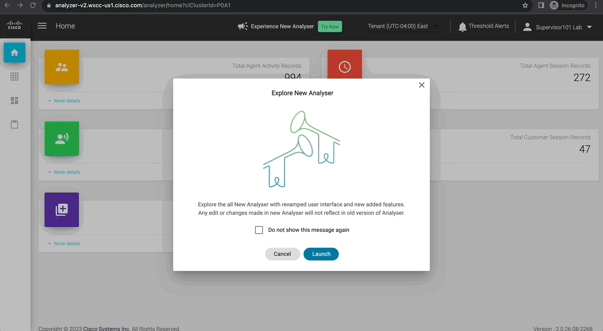
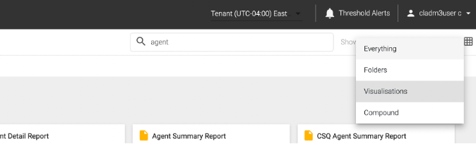
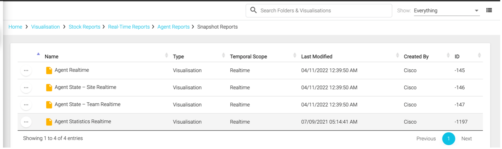
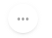
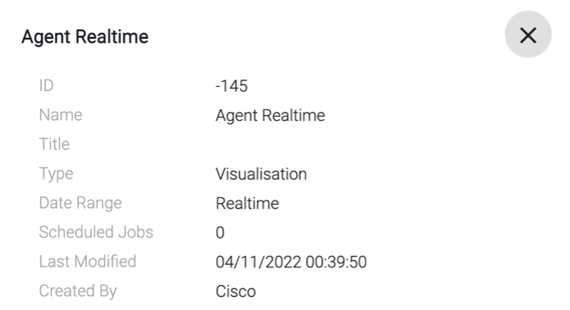
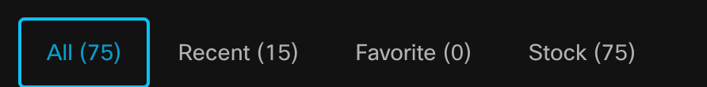
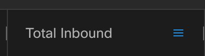
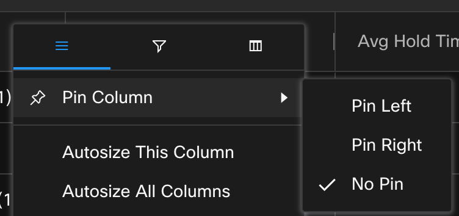

# LAB 1
<!-- **Webex Contact Center Analyzer User Interface** -->

## 1.1 Analyzer User Interface

This lab is designed to give you **basic understanding of Analyzer, user interface features** as well as the default dashboards available in the Admin Portal. In the following exercises, the goal is the **familiarization** with the product, interfaces and terminology.

1. At this point, you should be already logged-in to Analyzer. If not, use the steps above to login to [Analyzer](https://analyzer-v2.wxcc-us1.cisco.com/analyzer/home).

2. As you login, you may see this pop-up prompting to “Explore New Analyser”.
   $${\color{red}DO\space NOT\space LAUNCH\space it\space at\space this\space time\space and\space Click\space Cancel.}$$
   

3. Navigate around the home screen to learn the different features available on this screen.

   - Make a note of the sessions count for the four data repositories:
     - Customer Session
     - Customer Activity
     - Agent Session
     - Agent Activity  
       

4. Click on the **Visualizations** tab on the left.  
   

5. On the top in Search field, search for any key word like `agent`:

   - Click on **Agent Realtime** report and note down the path for this report.  
     
   - Searched items can be further filtered to show Visualizations or Folders from the `Show` dropdown menu.
     

6. Then, navigate to the following path:  
     
   Click  to change the view to `List` view.
   

   - Here you can sort the reports based on a specific header by clicking on the header.
   - Notice the **Temporal Scope**, which can be either **Realtime, Compound** or **Historical**.
   - ID is <ins>unique</ins> for every report and a report can also be searched by its `ID` besides the name.

7. Click the  icon next to the report and then click on **Details**.  
     
     

   - Make a note of the **Date Range** and **Scheduled Jobs**.
   - Try the same for any Historical stock report.  

8. On the top, click on your **username** and then **Help** to open the help manual for Analyzer.

   - This provides you with an online version of the [Analyzer User Guide](https://www.cisco.com/c/en/us/td/docs/voice_ip_comm/cust_contact/contact_center/webexcc/Analyzer_2/b_analyzeronloinehelp/_b_analyzeronloinehelp_chapter_01.html), a great document that provides information about all the available <ins>stock reports</ins>, <ins>variables</ins> as well as <ins>functionalities</ins> of Analyzer.

9. Click on **Tenant Time zone** option on the header. Set it to the time-zone in which you want to Run Visualizations (You have two possible options: **Tenant or Browser**).
   

## 1.2 NEW Analyzer User Interface

The **New Webex Contact Center Analyzer (Analyzer UX Refresh)** offers an enhanced and intuitive user interface that enables you to manage stock historical dashboards. It provides faster, more efficient, and focused views of historical analytics for Webex Contact Center, enhancing the integrated experience. The stock historical dashboards offer ready-to-use metrics, allowing you to generate metrics related to entry points, queues, teams, contacts, and agents for strategic decision-making.

> Note: The New Analyzer today does not currently provide custom dashboards. To access custom dashboards, you can use the existing Analyzer. Extending custom reporting support and adding real-time reports to New Analyzer UX is in our roadmap.
> {: .block-warning }

1. Login into the **New Analyzer**:

   - Click `Try Now` on the current Analyzer page.
     
     - New Analyzer will be cross-launched.
     - It may ask you to enter your supervisor username again.
     - You can also navigate between the new Analyzer and existing Analyzer using the browser tabs.

   

   You can see a new home page with centralized dashboards and reports. You'll see a new search bar to search through the various dashboards.

   

2. Report Tabs: Reports and Dashboards are grouped under following `Tabs`:

   - **All:** Lists all the dashboards and reports.
   - **Recent:** Lists the most recent dashboards that you viewed.
   - **Favorite:** Lists the dashboards that you have marked as favorite.
   - **Stock:** Lists the predefined stock historical dashboards provided by Cisco.

   Click on each Tab and make a **note of the number of reports** in each Tab.

   

3. Click on `star` icon next to the `Abandoned Call Detail Activity Report` to mark it as your **Favorite**.

   

   This allows you to access your favorite dashboards easily under the dedicated `Favorite` tab.

4. Next, view the `Agent Call Summary Report`, for this **double-click** on the dashboard name or select **View** under the **Actions** tab.

   
   

5. Next, review again the count of the reports in each tab and also if your **recently executed** report and **favorite marked** reports are visible under the respective tabs.

   

6. Use the `Sort By` drop-down menu to filter stock dashboards by options such as **Name, Created By,** and **Last Edited By**. This enables easy organization and navigation based on your preferred sorting criteria.

   

7. Switch to **Card View** by cliking .

   

   The **List View** is the default view and allows easy navigation and quick access to the entire collection of stock dashboards.

   The **Card View** provides a compact and visual representation of the stock dashboards, displaying snapshots of 15 dashboards in a single view.

8. Next, switch back to the List view and make a note of the `Labels` column.

   We've replaced folder-based navigation with `labels`. The **predefined labels** help you find and sort stock historical dashboards. The labels are color-coded to enhance the user experience. You can search for dashboards using labels.

   - All stock reports by default are marked with label `Stock`.  
     

9. Next, use the search box to find a stock dashboard using different criteria or comma separated words. For this example, search the word `transition`.  
   

   This would list all the **Transition reports**, which are built for easy reporting insights for customers migrated from UCCX but also useful for any customer.

   

   Customize your search selecting criteria such as **Name, Labels, Created By,** or **Last Edited By** from the drop-down menu.

10. Next, click on the user profile icon on the top right of the user interface provides user information. The time zone settings and dark mode options are available in the user profile settings.

    - **Time Zone**

      By default, the new Analyzer shows the tenant time zone. You can update the browser settings if necessary. <ins>Scheduled jobs always run in the tenant time zone.</ins>

    - **Dark Mode**

      You have the option to switch between dark and light screen modes to suit your viewing experience.

11. Next, let's take a look at **key functions** for a stock report. Go to the `Agent Call Summary Report`, which you viewed in **step #3**.

12. By default, data is displayed in `Table View` for `Last week`. Change it to `This month` and click **Apply**.
    What you see here is the Agent summary data for all the agents for this month.

    > Note: In the Table view of a dashboard, Analyzer supports a maximum of 100 columns and up to 100,000 rows.

13. Click on `Agent Endpoint (DN)` filter and make a note of device types used by the users (Agent and Supervisors). You would notice a **mix** of Dial numbers and WebRTC devices.

14. **Pin Column**

    You can **pin columns** or **move columns** of a dashboard to the right and left of the table based on your requirements.

    - On the dashboard, on the `Total Onbound` column, click the hamburger menu next to the column header.  
      
    - Go to `Pin Column` and click `Pin Left`.  
        
      This would move the **Total Inbound** column to the left of the table.  
      

15. **Autosize Column**

    Next, let's autosize all the columns as data in some columns is not clearly visible because of last textual size. To do so:
    On the dashboard column, click the **hamburger** menu next to the column header.

    1. Click `Autosize This Column`.
    2. For all columns, click `Autosize All Columns`.

    

    This would allow you to see all the data points clearly.

16. **Advanced Filtering**

    We already saw how you can use predefined filters on the reports. Beyond that, you can also filter the data data for other columns in the reports.
    In the current `Agent Call summary` report, let's filter the data to identify any agents which handled low number of calls.

    For this, click on Hamburger sign  next to the `Total Inbound` Column --> Click on the Filter  option and select **“0”** and **“1”**. Data will be updated immediately (No need to click Apply).

    

17. **Column View**

    You can customize the visibility of columns in the table. On the dashboard column, click the hamburger menu next to the column header. Click on **Column view** icon  and uncheck all `Time` field columns to exclude them and have a simpler count only view.

    

18. Switch the view of the report from `Table` to `Chart` by clicking  on top right corner of the report.

    

    You would notice a graphical view of the data for the number of `Total Inbound Contact` each agent handled during this month along with a trend line.

***Trend Line***

In **Chart** view, the new Analyzer introduces `Trend Line`, which is a visual representation of trends with data points. When viewing a dashboard, the presence of a trend line allows users to quickly identify and understand the underlying trend or pattern within the data.

Similarly you can try filter the data based on `Agent Name` and `Agent Endpoint (DN)`.

**Congratulations, you have completed this lab! You can continue with the next one.**
