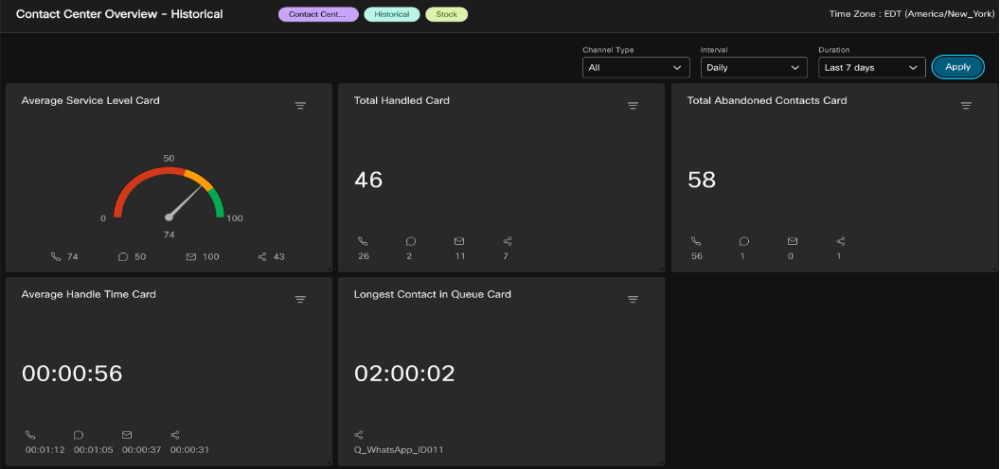
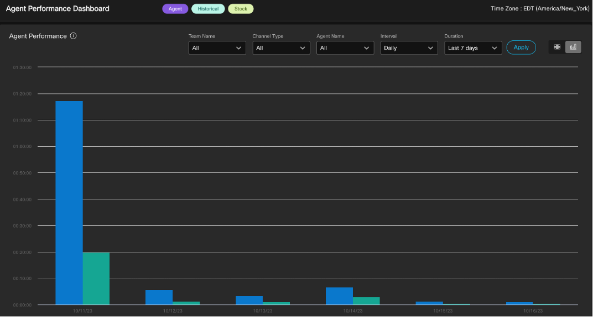
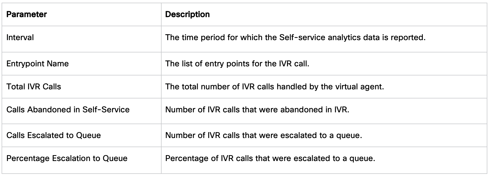

# LAB 2
<!-- # Part 2: Contact Centre Insights with New Analyzer Stock reports -->

In this section, we will delve into how various **personas** within a Contact Centre can leverage the Webex Contact Centre Analyzer to capture **Key Performance Indicators (KPIs)** and gain insights that can measure and enhance **customer experience, agent performance, and overall business outcomes**. We will explore some of the **pre-built stock reports** with **New Analyzer Interface**, which can help you gather these key actionable insights from day one.

## 2.1 High-level Contact Centre Performance and Usage Insights

**Persona:** CC Administrator, Supervisors, CC Manager, Leadership  
**Preferred View Type:** Chart, Trending

**Business Use Case:** Contact centre administrators play a crucial role in managing and optimizing contact centre operations. To effectively monitor and analyse the performance of the contact centre, it is essential for administrators to capture and track high-level contact centre state and usage data. This data provides valuable insights into various aspects, such as agent productivity, call volumes, customer satisfaction, and system performance. By capturing this information, administrators can make informed decisions, identify areas for improvement, and ensure efficient contact centre operations.

**A. Expected Insights and Actions**

**Monthly trending of total inbound and outbound contacts** over this year. Secondly, the **usage of different communication channels**, such as phone calls, emails, live chat, and social media interactions.

***Contact Centre Overview – Historical***

Search for the label `Contact Centre Overview` and double click on the `Contact Centre Overview – Historical` dashboard.

1. Make a note of the following **cards**: Average Service Level, Total Handled, Total Abandoned Contacts, Average Handle Time.
2. Switch the Duration to `This Year` and notice the change into these KPIs.
3. Select **Channel Type** and opt for digital channels only: Email, Chat and Social to observe the updated KPI’s.
4. Scroll Down the dashboard to the review the `Contact Details in Queue` Report.
5. On right upper corner, change `Contact Details in Queue` report to **Chart View**.
6. Observe the historical Queue volume and trending across last 7 days.

**Field Description**

**Contact Centre Overview – Historical** dashboard displays displays contact statistics for a specified duration and time interval. Users can filter data using drop-down lists. The available information includes:

- **Average Service Level**: Shows the percentage of contacts handled within the set service level.
- **Total Contacts Handled:** Displays the total number of contacts handled across various communication channels.
- **Total Contacts Abandoned:** Shows the total number of contacts that were abandoned.
- **Average Handled Time:** Indicates the average time taken to handle a contact.
- **Longest Contact in Queue:** Displays the waiting time for the contact with the longest queue time.
- **Contact Details in Queue:** Shows the details of contacts (voice, email, social, and chat)

***Contact Volume Historical Dashboard***

1. Search for `Contact Volume Historical Dashboard` and execute it.
2. You would notice all the dialed number and entry points in the contact centre across all the channels and the respective contact volume.
3. Switch to the **Chart view**.
4. Change duration to `This Year`.
5. Update Interval to `Monthly`, click `Apply`.
6. This provides you a trending view of contact volume for the year and comparison on monthly basis.
7. Update **Channel Type** filter to select `Telephony` and `Chat`. Observe the comparison data between these channels over the period of time.

**Field Description**

The parameters in this dashboard include DNIS (Dialed Number), Entry Point Name, Interval, Channel Type, and Contacts.

- **DNIS** is a service from the phone company delivering a number indicating the digits dialed by the caller. It's used as a row segment, but it doesn't appear for chat contacts.
- The **Entry Point Name** is the name of a particular entry point, also used as a row segment.
- **Interval** refers to a time period, specifically the last 7 days in this context.
- **Channel Type** denotes the media type of contact, like telephony, email, or chat, and it's used as a row segment.
- Finally, **Contacts** is a parameter that refers to the count of contact session IDs, serving as a unique identifier for each contact.

**Action:** Administrators analyse this data to assess channel preferences, allocate resources effectively, and identify opportunities for improving customer service across different channels.

***B. Expected Insights and Actions***

Trend and detailed insight of Agent performance metrics like `Max Connected Duration` and `Avg Connected Duration` across Agent Teams as well as Agent level break down optionally. This helps to identify any need of process improvements or additional agent training.

***Agent Performance Dashboard***

1. Search for `performance` in the search bar. Look for `Agent Performance Dashboard` and **double click** to view it.
2. By default, you will see a **Chart view** of the monthly data of `Max connected duration` and `Average connected Duration` with weekly interval.
3. You can try to switch the **Duration** and **Interval** to look for the data for longer or shorter period and notice the trend.
4. Switch to the Table View  and you will notice much more detailed data insights into each team and agent level.
5. Further filtering can be done based on **Team, Channel and Agent Name**, to gather insights around specific agent group.

**Action:** Look if the max connected duration is consistently high, it may indicate a need for process improvements or additional agent training. If the average connected duration is longer than desired, it may indicate the need to streamline processes, provide agents with additional resources or tools, or optimize call handling techniques. On the other hand, if the average connected duration is too short, it may indicate rushed interactions or missed opportunities for upselling or cross-selling.

## 2.2 Customer Experience and Queue Performance

**Persona:** CC Supervisors, CC Manager, Business Analyst  
**Preferred View Type:** Table

**Business Use-Case:** Capturing and analysing customer experience analytics in a contact centre is essential for businesses to understand and improve customer satisfaction levels. By gathering key data insights across every stage of the Contact including:

1. IVR
2. Self-Service / Virtual Agent
3. Queue performance including Transfer Rate after connection to an Agent
4. Queue Opt-out / Callback

**A. Expected Insights and Actions:**

Understanding the virtual agent's resolution rate, and escalation rate to the Queue.

To extract expected insights we can leverage stock report `IVR & CVA Dialog Flow Report`.

***IVR & CVA Dialog Flow Report***

This report displays the Self-service operational metrics. Which consist of:

- The **total number of IVR calls** handled by the **virtual agent**.
- Number of **abandoned calls in Self-service**.
- Number of IVR calls that were **escalated to a queue**.
- **Percentage** of IVR calls that were **escalated to a queue.**

**Steps:**

1. Search for label `selfservice`.
2. Look for `IVR & CVA Dialog flow` Report --> **Double click** to view it.

**Actions:** Refining the virtual agent's responses where escalation rate to the Queue is higher, training them on new issues.

**B. Expected Insights and Actions**

Supervisor looking for key performance metrics for their line of business (Queue) such as **Percentage Handled, Abandonment Rate, Avg Abandoned Time and Service Level.**

***CSQ All Fields Report***

The CSQ All Fields Report presents the queue-related data such as **call statistics, service level**, and key fields like **Average Queue Time, Average Speed of Answer, Calls Handled, and Calls Abandoned under service level**. This report combines the fields of all queue-related reports.

This report is also part of **Transitions reports** built in Webex Contact Centre to deliver the look and feel of Key Contact Centre Express (UCCX) reports to help customers who transitions to Cloud Webex Contact Centre.

**Steps:**

1. Search for Label `Transition`.
2. Look for `CSQ ALL Fields Report` and **double click** it to view.

**Actions:** Adjusting staffing levels and/or call routing improvements to manage peak times and low service level. Implement callback options to reduce wait times and abandonment rate.

**C. Expected Insights and Actions**

Offering the **callback** option to customers when they are in IVR or waiting in the Queue is one of the most efficient ways to improve the customer experience. Capture the callback success rate and reasons for failure.

***Callback Report***

The Contact Centre customer can opt to receive a callback from an agent while in IVR or waiting in a queue. The courtesy callback flow is configured by the flow developer.

**Actions:** For low Callback success rate review we would check on the `Final Reason`. One of the prime reasons for an unsuccessful callback request is that customers aren’t reachable or busy at callback time. Explore if offering the Callback Retry attempt ([CallbackFailed](https://www.cisco.com/c/en/us/td/docs/voice_ip_comm/cust_contact/contact_center/webexcc/SetupandAdministrationGuide_2/b_mp-release-2/wcc-flow-designer.html#Cisco_Concept.dita_2e773682-6129-4fb7-b857-4b56f57103bc)) for the callback would help improving the success rate and tweak it based on further review.

**Congratulations, you have completed this lab! You can continue with the next one.**
