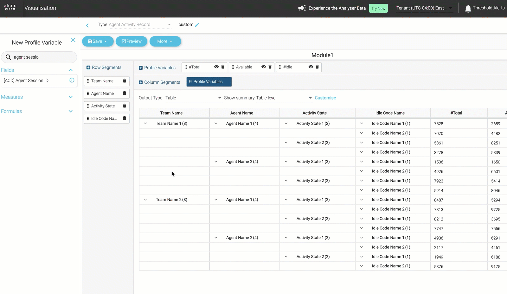
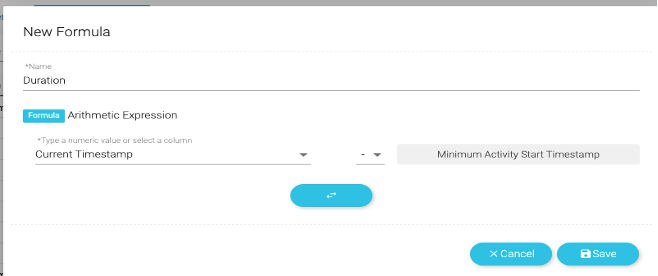
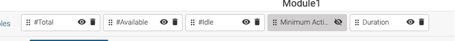
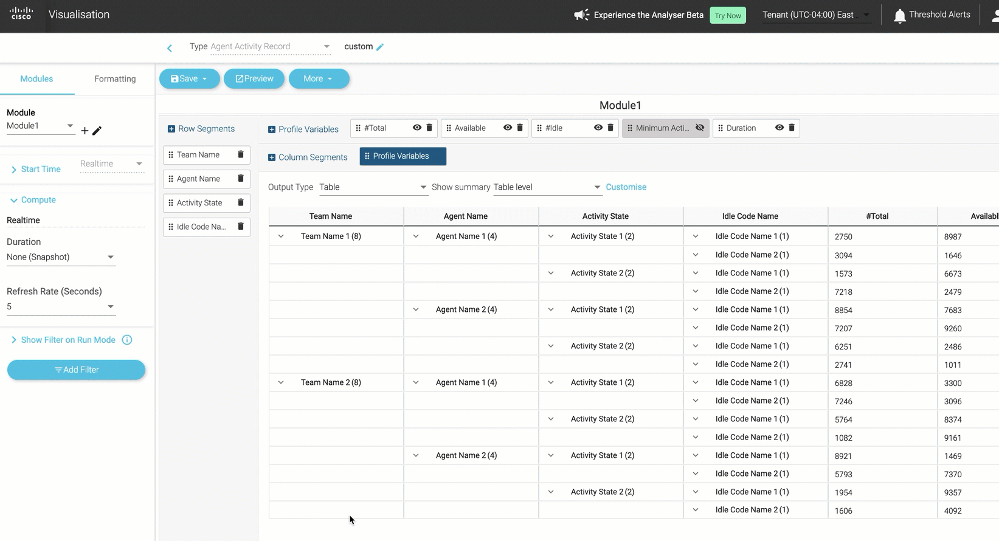
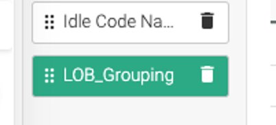
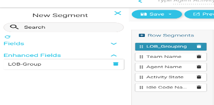
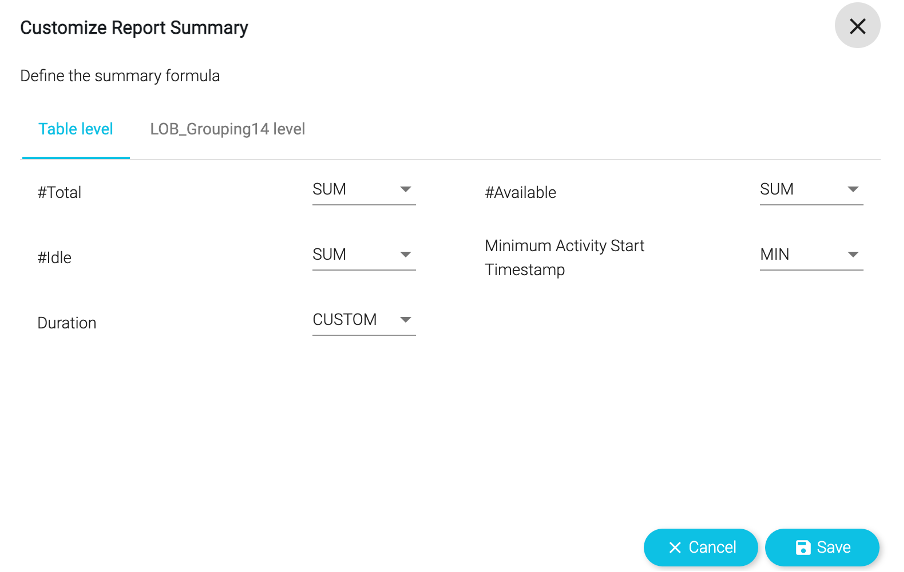

<script>
    function update(){them = Array.from(document.querySelectorAll("input")).reduce((acc, input) => ({...acc, [input.id + "_out"] : input.value}),{});
   Object.entries(them).forEach((entry) => {
    Array.from(document.getElementsByClassName(entry[0])).forEach((element,index) => 
    {
      console.log(document.getElementsByClassName(entry[0])[index].innerHTML); 
      document.getElementsByClassName(entry[0])[index].innerHTML = entry[1];
    })})

  event.preventDefault()
   if(document.forms["attendee-form"][1].value != "Your_Attendee_ID"){
    localStorage.setItem("attendeeID",document.forms["attendee-form"][1].value)
  }  
  }
</script>


# LAB 3
<!-- # Part 3: Contact Center Insights with Analyzer Custom Reports -->

!!! warning "README"

    In this lab, we will create a **custom report** to monitor the calls waiting in the queue in real-time, along with the available agents and their respective states. <ins>Since the option to create a custom report is currently unavailable in the New Analyzer UX, we will be using our current Analyzer interface for this lab.</ins>


In Webex Contact Center, there are four primary data repositories that store critical customer and agent-related information. These repositories are structured as follows:

!!! 1_Customer_Activity_Record

    === "Description"

        ```markdown
        - This type of record represents individual, atomic steps within the customer's workflow.
        - It captures key moments in the customer journey, providing insights into their interactions with the contact center. 
        ```
    === "Examples"

        ``` markdown
        - Customer in IVR or queue, talking to an agent, or on hold.
        - Customer on specific web pages, such as the home page, product page, or checkout page. 
        ```

!!! 2_Customer_Session_Record

    === "Description"

        ```markdown
        - Customer Session Records are more comprehensive, encapsulating the entire customer workflow. 
        - They consist of a sequence of customer activities, providing a holistic view of the customer's engagement with the contact center.
        ```
    === "Examples"

        ``` markdown
        - Customer calls the contact center for assistance.
        - Customer visits a website and explores its content.
        - Customer interacts with the website and engages in a chat with an agent.
        - Customer initiates contact by sending an email, and an agent responds.
        ```

!!! 3_Agent_Activity_Record

    === "Description"

        ```markdown
        - This record type focuses on individual actions within the agent's workflow. 
        - It logs every significant step an agent takes, shedding light on their interactions and status throughout their workday.
        ```
    === "Examples"

        ``` markdown
        - Agent's status transitions, such as idle, available, talking, or wrapping up.
        - Agent's offline activities, including dialing, note-taking, and reading emails.
        - Agent's involvement in chats with customers and the subsequent wrap-up process.
        ```

!!! 4_Agent_Session_Record

    === "Description"

        ```markdown
        - Agent Session Records provide a comprehensive overview of an agent's work. 
        - They encompass a sequence of agent activities, offering insights into the agent's handling of tasks and interactions.
        ```
    === "Examples"

        ``` markdown
        - An agent manages a service call, logging an incident or request.
        - An agent initiates an outbound call and schedules a meeting for a customer.
        - An agent engages in chat interactions with customers, providing answers and assistance.
        - An agent reads and responds to customer emails, ensuring effective communication.
        ```

<!-- 1. **Customer Activity Record**

   - **Description**: This type of record represents individual, atomic steps within the customer's workflow. It captures key moments in the customer journey, providing insights into their interactions with the contact center.
   - **Examples**:

     - Customer in IVR or queue, talking to an agent, or on hold.
     - Customer on specific web pages, such as the home page, product page, or checkout page.

2. **Customer Session Record**

   - **Description**: Customer Session Records are more comprehensive, encapsulating the entire customer workflow. They consist of a sequence of customer activities, providing a holistic view of the customer's engagement with the contact center.

   - **Examples**:

     - Customer calls the contact center for assistance.
     - Customer visits a website and explores its content.
     - Customer interacts with the website and engages in a chat with an agent.
     - Customer initiates contact by sending an email, and an agent responds.

3. **Agent Activity Record**

   **Description**: This record type focuses on individual actions within the agent's workflow. It logs every significant step an agent takes, shedding light on their interactions and status throughout their workday.

   **Examples**:

   - Agent's status transitions, such as idle, available, talking, or wrapping up.
   - Agent's offline activities, including dialing, note-taking, and reading emails.
   - Agent's involvement in chats with customers and the subsequent wrap-up process.

4. **Agent Session Record**

   **Description**: Agent Session Records provide a comprehensive overview of an agent's work. They encompass a sequence of agent activities, offering insights into the agent's handling of tasks and interactions.

   **Examples**:

   - An agent manages a service call, logging an incident or request.
   - An agent initiates an outbound call and schedules a meeting for a customer.
   - An agent engages in chat interactions with customers, providing answers and assistance.
   - An agent reads and responds to customer emails, ensuring effective communication. -->

These data repositories play a crucial role in capturing, organizing, and analysing the wealth of information generated within the Webex Contact Center, ultimately supporting informed decision-making and enhancing customer and agent experiences.

<!--  -->


Before you continue with this exercise follow below:

1.Login to agent desktop with your respective agent credentials and update agent status to `Meeting`


2.**Make a Call** to the respective Entrypoint DN assigned to you. You will be prompted to enter your 3-digit attendee ID (for Eg. If your attendee ID is 77, then enter 077) options to get to an agent, 
   
3.With no agent available you would hear a wait music. (_If this is not working, please reach out to the lab instructor_)

## 3.1 Create Custom Realtime Agent Report

In this Lab, we will create a **custom visualization** to showcase the **state of agents on a Realtime basis**.

**Objective:** Create an Agent Real-time state report with following data insights:

1.**State of Agents** on real-time basis for Telephony channel.
2.Capture **key metrics**:

   - Agent Team
   - Agent Name
   - Agent State
   - Idle Code
   - Total number of agents logged-in
   - Number of Agents in Available and idle state for each team
   - Duration in the State

3. Create a high-level view, based on **line of business** (Group or Teams).
4. Have **Data summarized** based on each Line of Business (LOB).
5. Have options to **filter the data** based on LOB and Idle code.
6. Create some **visual indication** when certain agents in Idle state for long duration.

While completing this Exercise, you will be able to understand and use some **key capabilities** like:

- Fields and Measures
- Enhanced Fields
- Formulas
- Drill-down
- Group Summary
- On the Fly-filter
- Filtering

1.Create a new **visualization** in Analyzer as an **Agent Activity Record**.

   - Set **Start Time** as `Realtime`.
   - Set **Duration** as `None (Snapshot)`.
   - **Refresh duration** as `5 Seconds`.

   <!--  -->


2.Next, we will begin adding variables to the visualization. Click on **Row Segment** and add:

   - Team Name
   - Agent Name
   - Activity State
   - Idle Code Name

   

   


3.Next, click on **Profile Variables** and add `Agent Session ID (Count)` and rename the name as `#Total`. Click `Save`


   <!--  -->

4.To capture **Available Agent Count** add `Agent Session ID`. Name it as `#Available`. Also, Drag `Activity State` as **Filter** with value `available`.
     <!--  -->


5.Repeat step 4 to add **Idle Agent Count**, this time with filter value `idle`. Name it as `#Idle`.


   <!--  -->

6.Next, we need to capture the **State Duration**. We will achieve this by using a **formula** to subtract the **activity start time** from **current time**, which will give us the **activity duration**.

   - Search for Measure Profile variable `Activity Start Timestamp`.
   - Under formula, select `Minimum Activity Start Timestamp` and save it. <br>
     <!--  -->
     
   - **Right click** on the field and click **New Formula** After, right click on the created field and click on `New Formula`. <br>
     
   - Name it **Duration** and swap the fields by clicking .
   - **Click**  on the empty field and select `Current Timestamp`.
   - Select  **Subtraction operator**, as shown below. Click `Save` <br>
     .
   - Right click the `Duration` profile variable, and set the **Duration Number Format** as `Duration > MM:SS`. <br>
     .
   - Hide `Minimum Activity Start Timestamp` by clicking on the **eye** icon. <br>
     .

7.**Re-order** the variables by dragging and dropping the variables in the order that you wish to see them in the report.

   

8.Save the report as `3.1_AAR_RT_AgentState_<YourStudentID>` (e.g. _3.1_AAR_RT_AgentState_101_) in your folder and click `Preview`.

   

9.Notice that the `#Total` count for each agent is **“16”**.

   - This is because each agent is a **multi-channel** agent (with Total 16 channels, 1 voice, and 5 Chat, 5 Email, 5 Social).
   - In this case we want to capture data for `Telephony` channel only so let’s add a **Channel Filter** for **Telephony**.
   - Go Back to the report edit mode and **Add Filter** with **Channel Type** as **Telephony**.

   <!--  -->
   


10.**Save** the visualization and click on `Preview` to run it again.


<!-- 11.We are still missing below asks:

 -->
<!-- 
12.Update the **Output Type** to `Column Heatmap`.

 -->

## 3.2 [Bonus] LOB Grouping

1.To create a LOB group

- Right click on the Team name and then `Create Enhanced Field`.
  
    
- Name the Field **LOB_Grouping{{StudentID}}**, replacing {{StudentID}} with your provided ID.

- **Add 2 groups** containing the following teams:
  - CL_G1x : Seach for “Team1” Select from 101_Team1 to 132_Team1
  - CL_G2x : Seach for “Team2” Select from 101_Team2 to 132_Team2

  

- Save it.

  

- Make this Enhanced Field **global** so it can be used for any other visualizations with need of creating it again.

- Right click LOB_Grouping{{StudentID}} --> Click Save --> When prompted, click Save again.

 
 

- Field is now saved and can be used in any other report.
- Move LOB_Grouping{{StudentID}} as top row segment.

  

2.To create a **Summary** at LOB level:

- Click `Show Summary` Option and select **LOB_Grouping**.


- Click `Customize` --> Go to **LOB_Grouping** level.


- Select `SUM` for **#Total**, **#Idle**, **#Avaliable** --> Save it.


3.Lastly, add the **on-the fly filters** for the **LOB Grouping** and **Idle Code Name**.

- Click on `Show Filter On Run Mode`.

 

- Select **LOB_Grouping** and **Idle Code Name**.
  
 

4.**Save** the visualization and check the `Preview`.

  

**Congratulations, you have completed this lab! You can continue with the next one.**


[def]: ./assets/images/Analyzer/custom3.pn