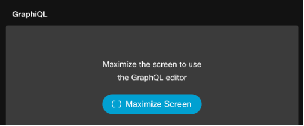
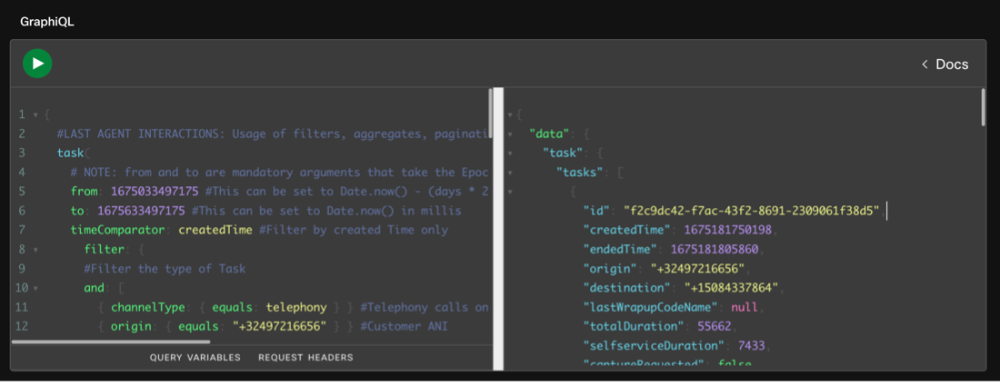

<script>
    function update(){them = Array.from(document.querySelectorAll("input")).reduce((acc, input) => ({...acc, [input.id + "_out"] : input.value}),{});
   Object.entries(them).forEach((entry) => {
    Array.from(document.getElementsByClassName(entry[0])).forEach((element,index) => 
    {
      console.log(document.getElementsByClassName(entry[0])[index].innerHTML); 
      document.getElementsByClassName(entry[0])[index].innerHTML = entry[1];
    })})

  event.preventDefault()
   if(document.forms["attendee-form"][1].value != "Your_Attendee_ID"){
    localStorage.setItem("attendeeID",document.forms["attendee-form"][1].value)
  }  
  }
</script>


# LAB 4
<!-- # Part 4: (BONUS) Data extraction and scheduling Capabilities -->

!!! warning "README"
    This bonus section covers the fundamental steps for exporting reporting data, scheduling reports, and accessing reporting data via the API. We highly recommend exploring the rest of the lab content first and revisiting this section if time allows.

Similar to Lab Part-3, **advanced data extraction** and **scheduling capabilities** are not avalaible in New Analyzer UX and are part of the roadmap. <ins>Hence, for this exercise, we will use the current Analyzer interface.</ins>


## 4.1 Export Data as Excel or CSV

Although Analyzer offers a lot of functionalities for users, Contact Center administrators and analysts often need to work with the data offline, modify them via Excel or even share the transformed information with other parties. In this exercise we will see how Analyzer allows users to **easily download the report results** from within the Analyzer interface.

1.Open `Incoming, Short, IVR Time- Entry Point` report in separate browser tab (or use any other open report in current Analyzer if you prefer).
2.Click on `Export` on the top and you have the option to `Export as Excel` or `Export as CSV`. Select to export the data as Excel.
3.File will be downloaded to your computer.
4.Now you can use this data offline, perform advanced calculations from Excel or share with your colleagues as needed.


## 4.2 Visualization Scheduler

In this exercise we will learn how to **schedule visualizations within Analyzer**. In Analyzer, you can schedule any historical visualization to be **run and sent in a predefined time period to an email address**. This is very handy for admins or supervisors who need to see reports on a scheduled daily, weekly or monthly basis.

1.Find the report `CSQ All Fields Report`.

   

2.Next, in the right-hand corner of the report, select the three ellipsis and from the dropdown select the option **Schedule Job**. <br>
   

3.Fill in the schedule information for the scheduled report.

   - Start with the **Job Name**. Let’s set this to run daily so we will give it the name **CSQ All Fields Report_Daily**.
   - Choose a start date and time. Select today’s date with a time of a few minutes ahead of your current time to give it time to trigger.
   - Next complete the details for the email notification by entering in your email address and a subject line.

   

4.Once **saved**, the scheduled job will show up under the `Jobs` list.

   

5.If everything was setup correctly, check your email for the report after the trigger time has passed.

6.If your job was only set to run once, once it runs, that job is deleted from the jobs list.
7.**Close** the job scheduling window. Go back to the folder structure and look at the Details of the report, it will show the number of jobs scheduled. You should see 1 scheduled job to reflect the job we just scheduled in this exercise.


## 4.3 Search APIs

In this exercise, we are going to use the API to retrieve the LastAgentInteraction example from Github to find when a customer called in the last 7 days and which agent they reached.

1. Open Developer portal using this link: [Search Tasks Documentation](https://developer.webex-cx.com/documentation/search/v1/search-tasks)

2. Login with your Admin user.

   

3. Click **Try Out -> Maximize Screen**.

    <br>
   

4. You can explore the schema by clicking on Docs to open the **Documentation Explorer**. On the explorer, click on **Query -> task -> TaskList**.

   

5. Now let’s execute a query and see what data you get. <ins>Update the Origin number highlighted in yellow in below query with the phone number you are using to make the test calls.</ins>

6. Go to the query window and **delete** the text first **before** you paste the new query with your number.

7. Then, paste the snippet in Query space and click Run . You should see results similar to the following:



- Use https://www.epochconverter.com/ converter to convert your respective from and to timestamps for use in the query
```
{
  #LAST AGENT INTERACTIONS: Usage of filters, aggregates, pagination and custom fields to find when the customer called last in a 7 day window and who they reached
  task(
    # NOTE: from and to are mandatory arguments that take the Epoch timestamp in milliseconds
    from: 1675638001000 #This can be set to Date.now() - (days * 24 * 60 * 60 * 1000) for lookback in days
    to: 1675782001000 #This can be set to Date.now() in millis
    timeComparator: createdTime #Filter by created Time only
      filter: {
      #Filter the type of Task
      and: [
        { channelType: { equals: telephony } } #Telephony calls only
        { origin: { equals: "XXXXXXXXXXXX" } } #Customer ANI
        { status: { equals: "ended" } } #Final Disposition
        { direction: { equals: "inbound" } } #Inbound call only
        { isActive: { equals: false } } #Resolved call only
        { owner: { notequals: { id: null } } } #Only calls that had an Owner
      ]
    }
    pagination: { cursor: "0" } #Display first page only
  ) {
    tasks {
      #Task Metadata
      id
      createdTime
      endedTime
      origin
      destination
      lastWrapupCodeName #Why the customer called
      totalDuration
      selfserviceDuration
      captureRequested
      #Treatment Details
      lastEntryPoint {
        #Entrypoint Details
        id
        name
      }
      lastQueue {
        #Queue Details
        id
        name
      }
      lastTeam {
        #Team Details
        id
        name
      }
      owner {
        #Agent Details
        name
        id
      }
    }
    #Pagination Information
    pageInfo {
      endCursor
      hasNextPage
    }
  }
}
```

**Congratulations, you have officially completed the Webex Contact Center Reporting Experience labs!**
