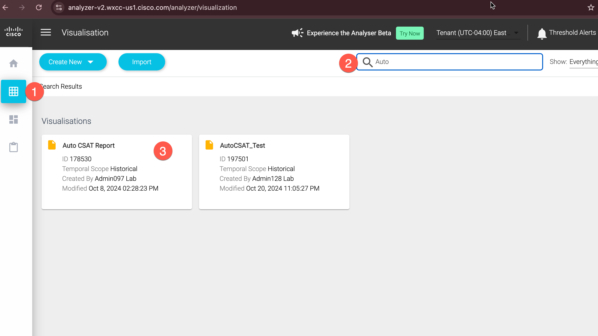

<!-- md:option type:warning -->

!!! warning "README"

    Due to the requirements and scope of this lab, we will not be setting up the surveys and the auto CSAT feature from start to finish. Instead, we will review the necessary steps for configuration and explore the existing setups and reports related to the auto CSAT feature.

## 5.1 What is Auto CSAT score?

Auto CSAT predicts post-interaction CSAT for all customers, enabling contact centers leverage every interaction for insights and decision making to maximize customer satisfaction and agent performance. This feature uses the operational metrics and customer & agent sentiments associated with your contact centre interaction to predict and assign a CSAT score for that interaction. 


!!! Requirements

    === "SurveyReports"

        ``` markdown
        - 180 days of historical CSAT records collected from existing surveys. 
        ```
    === "Sentiment"

        ``` markdown
        - Based on voice call transcripts. 
        ```
    === "CustomerSessionRecords"

        ``` markdown
        - Various parameter of Customer Session Records. 
        ```
## 5.2 How to setup Auto CSAT feature?

1.Explore steps to setup up a survey with CSAT questions in the 'Surveys' tab. (Please note that new configuration need not be created)


:link: [Detailed survey configuraiton guide](https://help.webex.com/en-us/article/nlu4x20/Experience-Management---Interactive-Voice-Response-Surveys-for-Webex-ContactCenter)

<!-- 2.Enable auto csat feature, select agents and survey questions. Please note that this feature is already enabled in the lab tenant. No action needed. If in case you do not see this section in Control hub, please ignore and go ahead with the next section. 

 -->


## 5.3 Where can the Auto CSAT score be viewed?

The scores will be published in the Call Session Records (CSR) and can be accessed using the GraphQL API. The scores will also be available in Analyzer for customers to generate custom reports 

1. Log-in to [Webex Control Hub](https://admin.webex.com) with your admin credentials
2. Launch the Analyzer application that is used for Reporting on Webex Contact Center

    

3. Open the Analyzer. Search and optn the report named "Auto CSAT Report"

     

4. Explore the report. Values can be filtered based on CSAT scores. These reports can be consumed from the supervisor or agent desktop if required.

     

**Congratulations, you have completed this lab! You can continue with the next one.**
