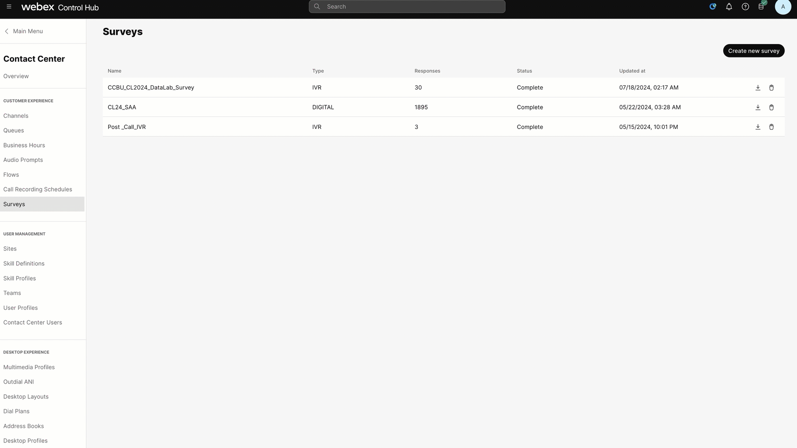
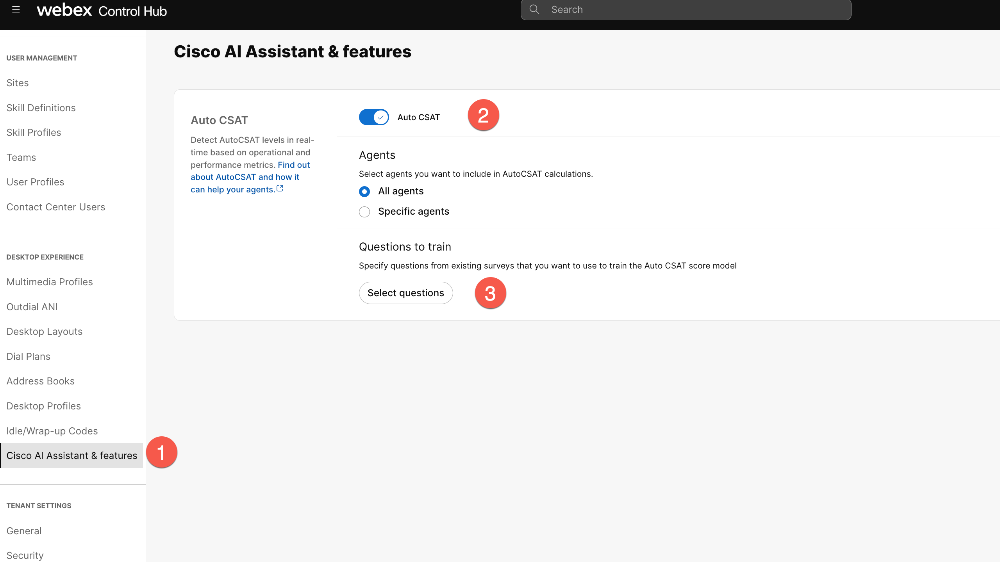
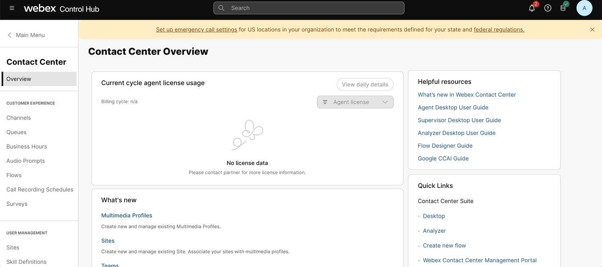
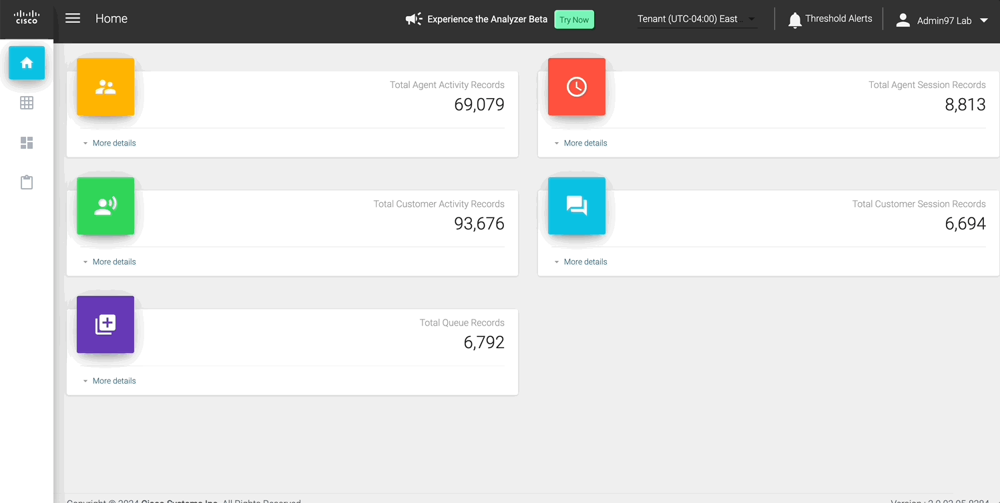

<!-- md:option type:warning -->

!!! warning "README"

    Due to the requirements and scope of this lab, we will not be setting up the surveys and the auto CSAT feature from start to finish. Instead, we will review the necessary steps for configuration and explore the existing setups and reports related to the auto CSAT feature.

## 5.1 What is Auto CSAT score?

Auto CSAT predicts post-interaction CSAT for all customers, enabling contact centers leverage every interaction for insights and decision making to maximize customer satisfaction and agent performance. This feature uses the operational metrics and customer & agent sentiments associated with your contact centre interaction to predict and assign a CSAT score for that interaction. 


!!! Requirements

    === "SurveyReports"

        ``` markdown
        - 180 days of historical CSAT records collected from existing surveys. 
        ```
    === "Sentiment"

        ``` markdown
        - Based on voice call transcripts. 
        ```
    === "CustomerSessionRecords"

        ``` markdown
        - Various parameter of Customer Session Records. 
        ```
## 5.2 How to setup Auto CSAT feature?

1. Setup up a survey with CSAT questions in the 'Surveys' tab. 

     

:link: [Detailed survey configuraiton guide](https://help.webex.com/en-us/article/nlu4x20/Experience-Management---Interactive-Voice-Response-Surveys-for-Webex-ContactCenter)

2. Enable auto csat feature, select agents and survey questions. 

     


## 5.3 Where can the Auto CSAT score be viewed?

The scores will be published in the Call Session Records (CSR) and can be accessed using the GraphQL API. The scores will also be available in Analyzer for customers to generate custom reports 

1. Log-in with your admin credentials to admin.webex.com
2. Launch the Analyzer application that is used for Reporting on Webex Contact Center

    

3. Open the Analyzer Report titled "Auto CSAT Report"

     

4. Observe the actions taken by the contact center system once a burnout event is detected.
5. Note how contact center administrators have tools today to address and support the wellness of their agents.

     

**Congratulations, you have completed this lab! You can continue with the next one.**
