!!! warning "README"

    Due to the requirements and scope of this lab, we will not be setting up new topic analtics collection. Instead, we will review the necessary steps for configuration and explore the existing topics and reports related to the feature.

The objective of this lab is to gain a comprehensive understanding of Topic Analytics in Webex Contact Center to help identify potential candidates for automation, and apply the insights gained to enable subsequent AI-powered automation processes. This involves exploring various Topics identified by the AI model, analyzing individual conversations to identify areas of Automation. In this lab you are tasked to identify the top two opportunities for automation and capture the essential information needed to create the automation workflow by reviewing the customer conversations.

## 6.1 Access the Topic Analytics Portal

- Login to the Webex Control Hub using the admin credentials provided. ( Launch https://admin.webex.com/ )
     
     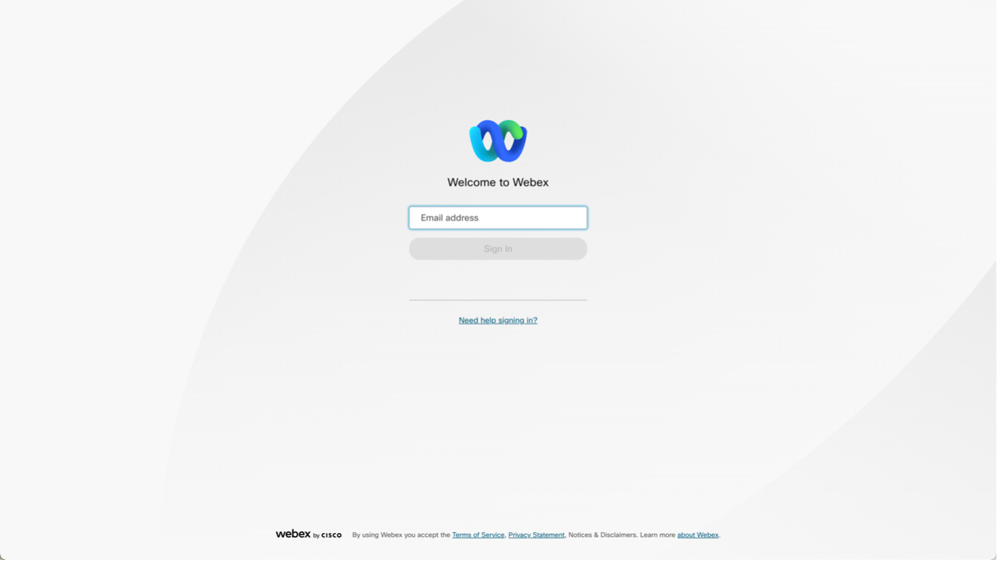

- Login using the same admin credentials if you are redirected to Okta login
     
     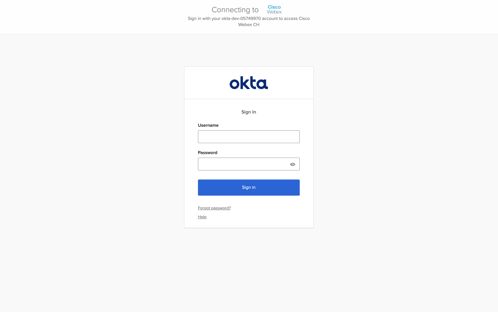

- Scoll down the the left navigation panel and click on Contact Center under Services
      
      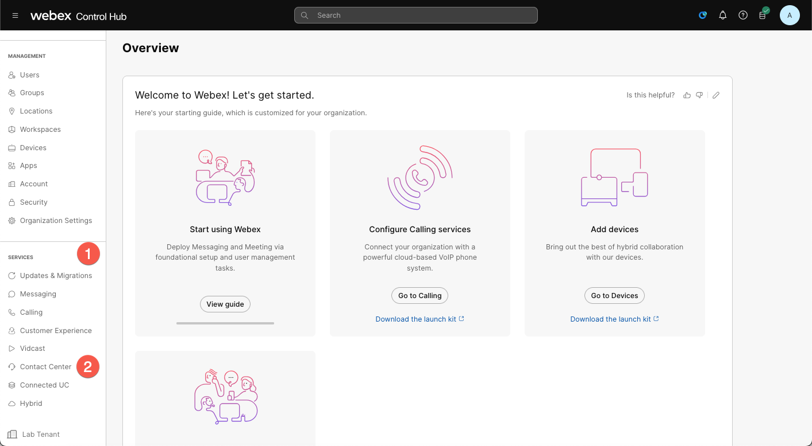

- Launch Topic Analytics Portal by clicking on Topic Analytics under the Quick Links. Enter the admin email address to sign-in. Once you are signed-in accept the Oauth2 Notification.
      
      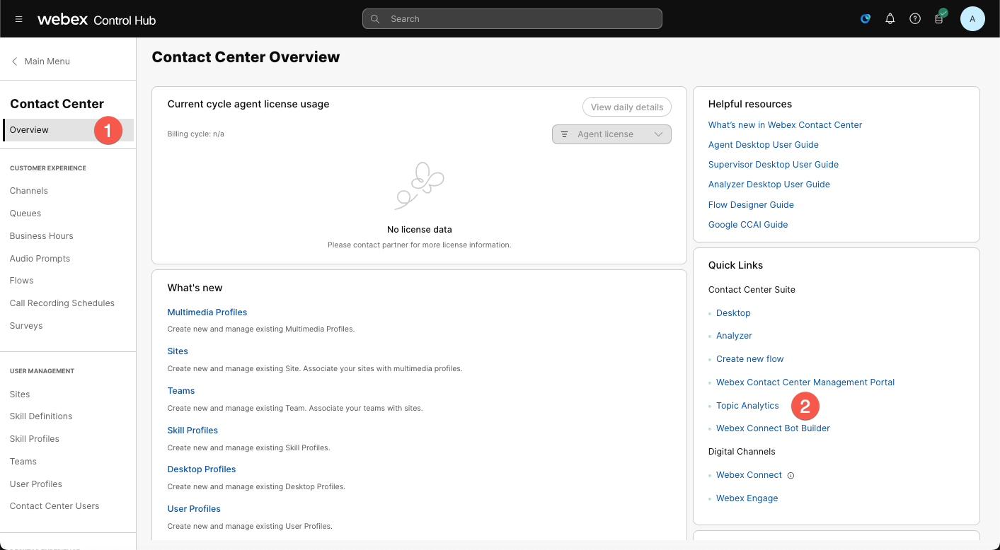

- Once logged in, click on the Topic Analytics from the left side navigation panel.
      
      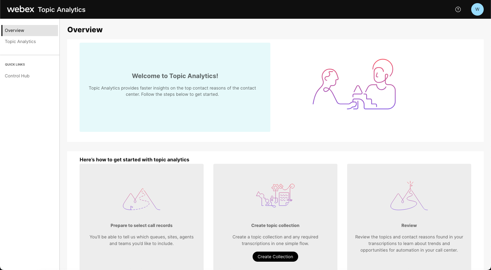

- Note creation of Topic collection can take up to 24 hours hence a Topic collection `TechSummitDemo`on is already pre-created for you.
      
      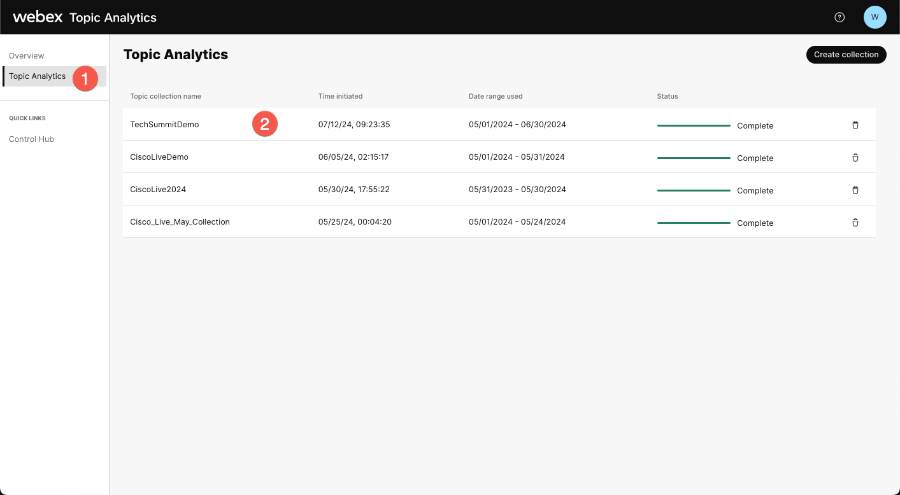

## 6.2 Review the Topic Collection

- Click on the `TechSummitDemo` to review the Topic collection. Under the Overview Tab, Notice the filter criteria used to create this collection.
      
      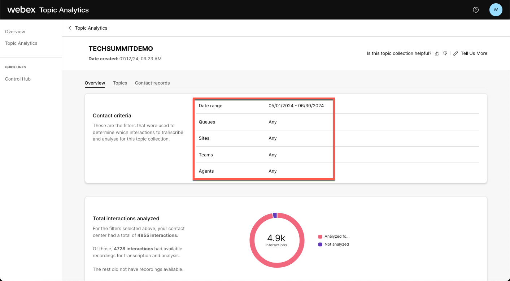

- Click on the Topics Tab to view all the topics identified by AI for this filter criteria.
      
      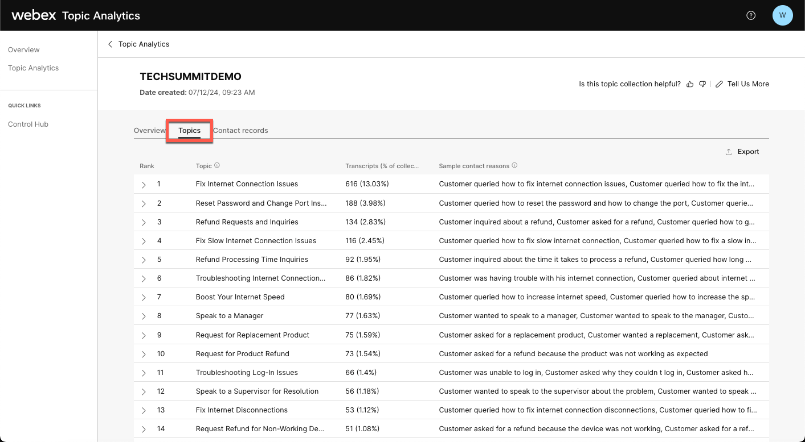

- Additionally, you can click on the Expand button (>) to view all the call drivers associated with the Topic.
     
      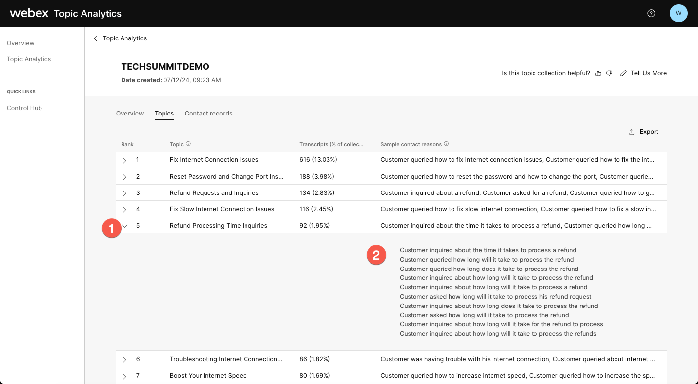

- Click on the Export button on the top right to download the result in the excel sheet.
      
      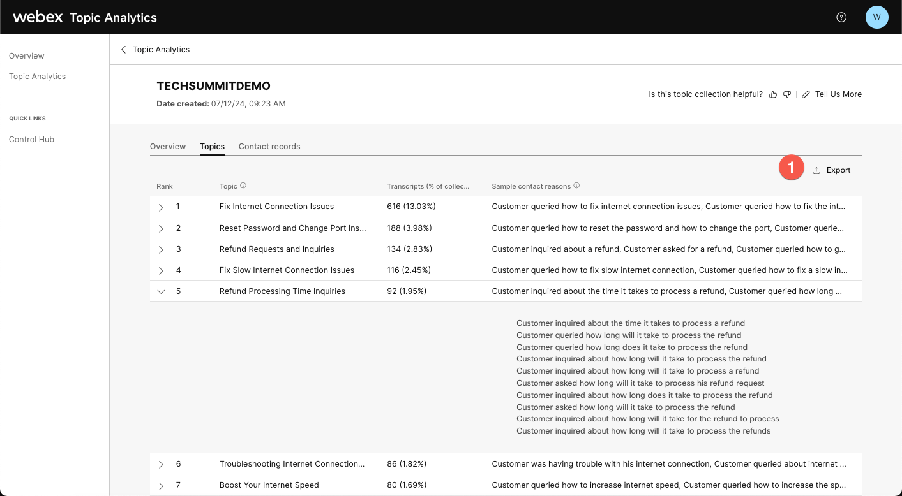

## 6.3 Analyzing Conversations for a Given Topic

- Click on a Topic to view all the calls related to that Topic.
      
      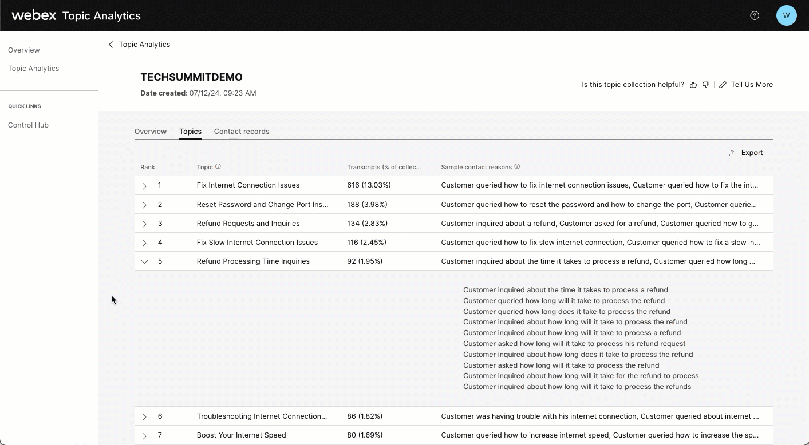

- Click on individual call record to view more details such as the call recording, transcript and the Contact Details.
      
      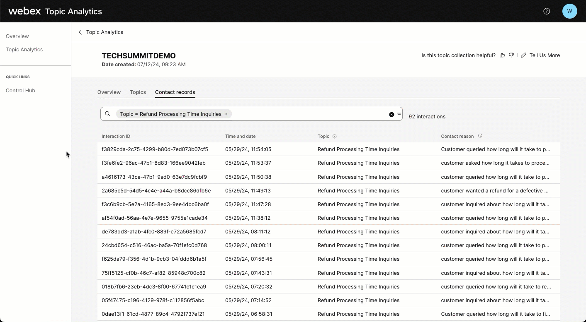

- By reviewing the rank and the transcript one can identify the top use cases and create workflows or explore other automation opportunities. 
      
      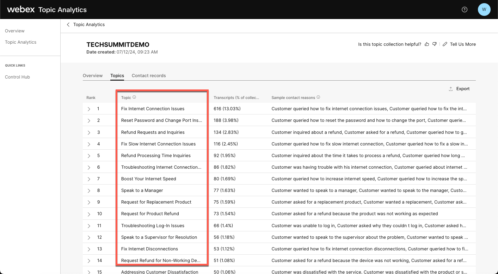

:link: [Detailed survey configuraiton guide](https://help.webex.com/en-us/article/v72wjab/Get-started-with-Topic-Analytics)

**Congratulations, you have completed this lab! You can continue with the next one.**

