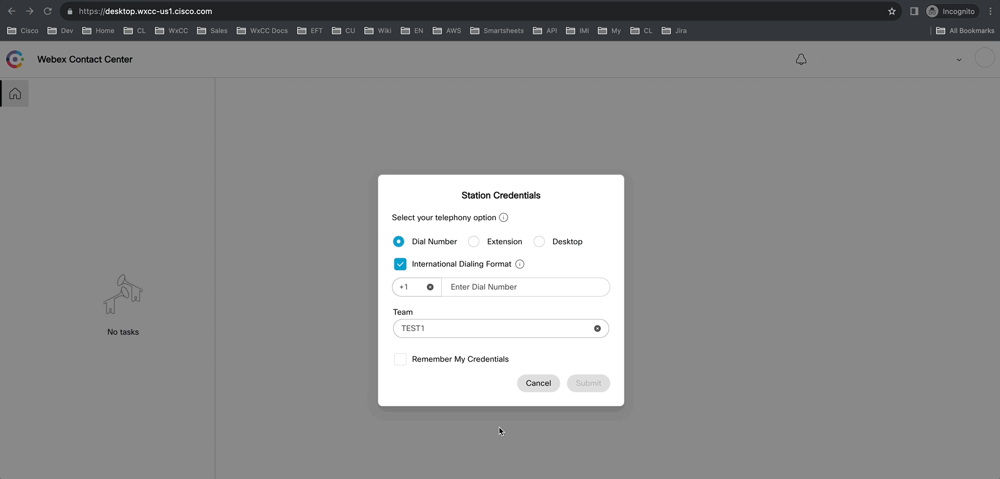
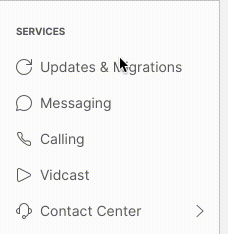

!!! info "README"

    In this lab, we will make a test call to check the post-call survey feature using a pre-configured voice flow. We'll complete the survey as customers and then review/download the survey results from the administration portal. The steps for configuring the actual survey flow are at the end of this section but are not required to for this lab.

## 7.1 Agent Login

!!! tip "Please submit the form below with your Attendee ID in 3 digits long format (e.g. if your attendee ID is 51, please enter 051) and click Save. All configuration items in the lab guide will be renamed with that prefix."

    
    <form id="attendee-form">
    <label for="attendee">Attendee ID:</label>
    <input type="text" id="attendee" name="attendee" onChange="update()" style="border: 2px solid black; padding: 5px; border-radius: 4px; background-color: orange;"> 
     
    <button type="button" onclick="update()" style="background-color: #4CAF50; color: white; padding: 10px 20px; border: none; border-radius: 5px; cursor: pointer; font-size: 16px;">Save</button>
    </form>
    

| **User Role** | **User email**                                                   | **Endpoint**   |
| ------------- | ---------------------------------------------------------------- | -------------- |
| Agent         | wxcclabs+agent\_<w class="attendee_out">AttendeeID</w>@gmail.com | WebRTC/Desktop |

> **Note**: To log in to the agent desktop, use either a different web browser or a new incognito web page. This will prevent the browser caching issues with admin and agent credentials.
>

- Navigate to **[Desktop](https://desktop.wxcc-us1.cisco.com/){:target="\_blank"}** in the chrome browser with the incognito mode.

- Enter the agent’s **email ID**.

- Enter the **Password** for the appropriate username.

- In the **_Station Credentials_** pane, select **"Desktop"**.

- Select the team **<w class="attendee_out">Your_Attendee_ID</w>\_Team1**.

- Click the **_Submit_** button. The browser may ask you to confirm the use the microphone from the browser.

- Make sure that you are successfully logged in to the Agent Desktop.

## 7.2 Provide a survey response

- Login to your Agent Desktop and make your state Available

- Dial  `+14402308301`  and enter your `Attendee ID` followed by `#`

- Accept the call from the agent desktop and disconnect the call by clicking the `End Call` button in agent desktop

     

- End the interaction from the Agent Desktop
- The customer voice call leg should now connect to the IVR survey flow. Follow the instructions and provice the survey rating

## 7.3 Access Survey Response Report

- From Control hub, access `Analyzer`

     

- Navigate to Visualisation > search for `Survey Response` and open the report. 

     

- Survey response that you provided in the previous section will take close to 20 minutes to show up in the report. However, you can view the historic survey responses in the report and explore the filter options

     

## 7.4 Download Survey Response Report

- Navigate to `Surveys` section in control hub and click the download option against one of the configured surveys

     

- Choose desired response time period and click `Download`

     

## 7.5 [OPTIONAL] Configure new survey

- Click on Contact Center under Services from Control Hub
     
     

- Under Contact Center, click on Surveys
     
     

- Click the “Create new survey” button on the top-right corner of the Survey page

     

- Provide name for your survey as **Survey\_<w class="attendee_out">AttendeeID</w>** . Survey has to be named in this format for the flow to work. Select Language and click `Next`

     

- Download the audio files : 
  
- Upload `Welcome.wav` in the `Welcome note` section

     

- Add a desired survey question and upload `nps.wav` 

    

- Upload `Thankyou.wav` in the `Thank you note` section

    

- Review the audio files if required and click `Next`
    
    

- Click `Save`
    
    

## 7.6 [OPTIONAL] Add the feedback activity to your flow

- Navigate to `Flows` section in control hub and make a copy of the `Survey_Template` flow 
    
    

- Search for the string `Copy_Survey` and open the flow

    

- Edit the flow and rename it as **Survey\_<w class="attendee_out">AttendeeID</w>**

    

- Navigate to `Event Flow` , select `FeedbackV2` activity and under `Survey Method` select your respective survey created in the previous section

    

- Validate and publish the flow

    

- Map this flow to the respective Entrypoint DN assigned to you. 

- Navigate to `Channels` , lookup for **WX1_EP\_<w class="attendee_out">AttendeeID</w>** and select it. 

- Update `Routing Flow` as **Survey\_<w class="attendee_out">AttendeeID</w>** and `Version Label` as `Live` . Click Save.

    

- Login to your Agent Desktop and make your state Available

- Dial the respective DN assigned to your entrypoint  **WX1_EP\_<w class="attendee_out">AttendeeID</w>**  and enter your `Attendee ID` followed by `#`

- Accept the call from the agent desktop and disconnect the call by clicking the `End Call` button in agent desktop

     

- End the interaction from the Agent Desktop
- The customer voice call leg should now connect to the IVR survey flow. Follow the instructions and provice the survey rating

**Congratulations, you have completed this lab! You can continue with the next one.**
