<script>
    function update(){them = Array.from(document.querySelectorAll("input")).reduce((acc, input) => ({...acc, [input.id + "_out"] : input.value}),{});
   Object.entries(them).forEach((entry) => {
    Array.from(document.getElementsByClassName(entry[0])).forEach((element,index) => 
    {
      console.log(document.getElementsByClassName(entry[0])[index].innerHTML); 
      document.getElementsByClassName(entry[0])[index].innerHTML = entry[1];
    })})

  event.preventDefault()
   if(document.forms["attendee-form"][1].value != "Your_Attendee_ID"){
    localStorage.setItem("attendeeID",document.forms["attendee-form"][1].value)
  }  
  }
</script>
**Customer Journey Data Services (JDS)**

**Lab Objective**
This lab is designed to teach you the concepts and functionalities of Customer Journey Data Services (JDS), both in regard to the JDS Widget that can be added in Agent Deskpulltop as well as the API capabilities of the solution, since JDS remains an API-first solution today. You will learn how to use the JDS widget, how to add new customers (identities) to your JDS database as well as how to use the JDS APIs to extract information and act upon it. 


<!-- ### Pre-requisites
- You have Admin access to Control Hub 
- You have completed [**Part 1: APIs on Webex Contact Center (WxCC)**](#APIs-on-Webex-Contact-Center) -->

!!! tip "Please submit the form below with your Attendee ID in 3 digits long format (e.g. if your attendee ID is 51, please enter 051) and click Save. All configuration items in the lab guide will be renamed with that prefix."

    <script>
    document.forms["attendee-form"][1].value = localStorage.getItem("attendeeID") || "Your Attendee ID"; 
    update();
    </script>
    <form id="attendee-form">
    <label for="attendee">Attendee ID:</label>
    <input type="text" id="attendee" name="attendee" onChange="update()" style="border: 2px solid black; padding: 5px; border-radius: 4px; background-color: orange;"><br>
    <br>
    <button type="button" onclick="update()" style="background-color: #4CAF50; color: white; padding: 10px 20px; border: none; border-radius: 5px; cursor: pointer; font-size: 16px;">Save</button>
    </form>
    <script>
    document.forms["attendee-form"][1].value = localStorage.getItem("attendeeID") || "Your Attendee ID";
    update();
    </script>

8.1: Exploring JDSs APIs & Widget
JDS Desktop Widget provides agents with an interface that shows the end customer’s complete journey with the agent’s business, aggregated metrics of their experience as well as the customer’s unique identifiers (aliases).


- **Identity / Person**: A unique customer, all the events that the same customer (e.g. call, chat, email, visit website) creates are marked under the same identity.
- **Alias**: Different ways we can identify the same customer/person (e.g. email, phone number, Customer ID). Customer must have at least one alias.
- **Profile Template**: A profile template defines the kind of aggregation technique we want to see for a customer (e.g. contacts within _last 24 hours_).
- **Progressive Profile**: The values that correspond to an identity’s profile template at that particular moment of time (e.g. contacts within last 24 hours = _10_).


## 8.1 Adding a new identity

> Note 1: For this task, you must have an admin account with the **"Full admin"** permissions.\
> Note 2: To save time, we will be skipping the below exercise. Please read it and go to the next task.
{: .block-tip }

1.	Add a new identity for yourself to JDS project. Navigate to Control Hub with your administrator credentials.

2.	Navigate to Customer Journey Data under Monitoring.


3.	A project (named  **Lab Tenant**) has already been created for the purposes of this lab. Click on it to check its configuration.

4.	Click on the Identities tab. Identities are all the end-customer profiles created to be tracked by this specific JDS project.
 


5.	Click on **Add Identities** button. In the UI you can only add identities by uploading a CSV file. To check the expected format of the CSV, click on Download to download the sample template.
 
6.	Open the file. You see the expected format is the following:
```Id,First Name,Last Name,Email Addresses,Phone Numbers,Customer Ids```

7.	Enter a row with your details keeping in mind the following:
•	**Id** field should be left empty.
•	If you want to add multiple **email addresses, phone numbers or customer IDs**, you need to use the pipe “|” delimiter between them. For example, try to add your phone number both with and without a plus sign.
•	**Customer ID** is a unique ID given by the JDS administrator to each customer. Make sure to use a large number to avoid conflicts with existing customer IDs.

8.	Based on the above, your new line should look similar to this:
 


9.	Save the file and go back in Control Hub, click on **Choose a file** and select the file you created. Click on **Next**. If all is good, you will see the Import Status as _Completed_. In case of errors, you will get the message Completed with Errors and the option to download the error file to understand what you need to fix.

10.	Click on **Close** button. You should now be able to see your created identity in the list.


## 8.2 Update Desktop layout & Login to dekstop

!!! info "README"

    To optimize our time in this lab, we will utilize a pre-configured desktop layout that includes the modifications related to the journey widget. If you are interested in adding the CJDS widget to your existing desktop layout, you can find the code snippet and instructions [here](https://github.com/CiscoDevNet/cjaas-widgets/blob/main/CustomerJourney/README_VERSION_10.0.0.md#how-to-add-the-cjds-widget-into-an-existing-desktop-layout).

1. Download this desktop layout: [Layout with Journey Widget pre-configured](https://github.com/CiscoDevNet/cjaas-widgets/blob/main/CustomerJourney/src/assets/JDSDesktopLayout10.json)

    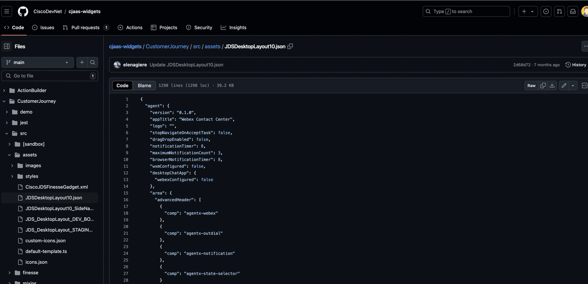

2. Open/Edit the layout in a text editor. For test purposes, let's add the same widget to the **Navigation** panel as a page. This will help us to test the widget even when an agent is not on a call. For this find the **navigation** area in your Layout and add that code
```
{
          "nav": {
            "label": "JDS System Widget",
            "icon": "https://static.thenounproject.com/png/508797-200.png",
            "iconType": "other",
            "navigateTo": "CustomNav6",
            "align": "top"
          },
          "page": {
            "id": "customNav6",
            "widgets": {
              "right": {
                "comp": "customer-journey-widget",
                "script": "https://journey-widget.webex.com",
                "attributes": {
                  "show-alias-icon": "true",
                  "condensed-view": "true"
                },
                "properties": {
                  "interactionData": "$STORE.agentContact.taskSelected",
                  "bearerToken": "$STORE.auth.accessToken",
                  "organizationId": "$STORE.agent.orgId",
                  "dataCenter": "$STORE.app.datacenter"
                },
                "wrapper": {
                  "title": "Customer Journey Widget",
                  "maximizeAreaName": "app-maximize-area"
                }
              }
            },
            "layout": {
              "areas": [["right"]],
              "size": {
                "cols": [1],
                "rows": [1]
              }
            }
          }
        },
```

    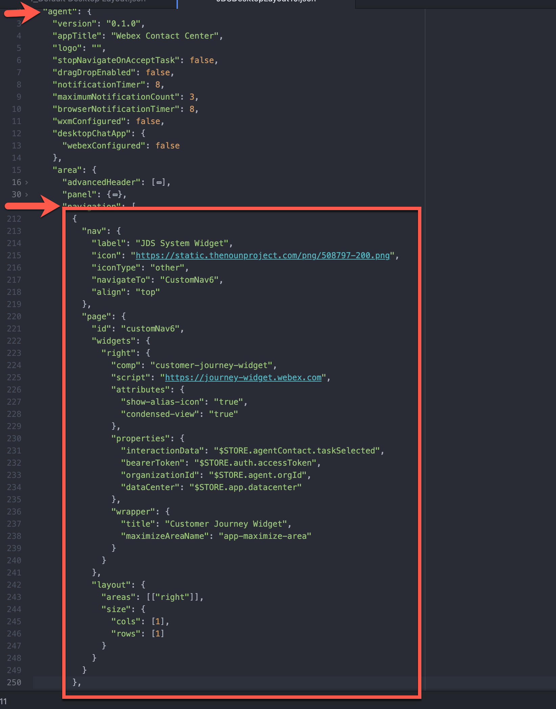


3. Go to Control Hub -> Contact Center ->  Desktop Layouts and Create a new Desktop Layout. 

    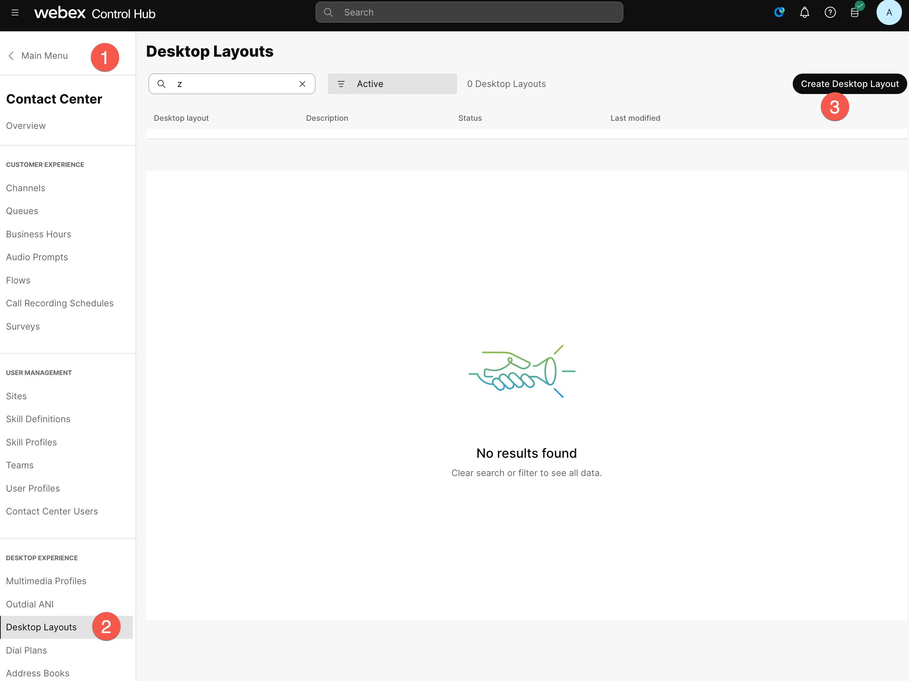

4. Set the name of the desktop layout as  "**<w class = "attendee_out">AttendeeID</w>_Layout**" (example: **140_Layout**). Click on **Replace file** and upload the file that was downloaded and edited in the previous step. Select your respective team (Select the team "**<w class = "attendee_out">AttendeeID</w>_Team**"), and click **Create**.

    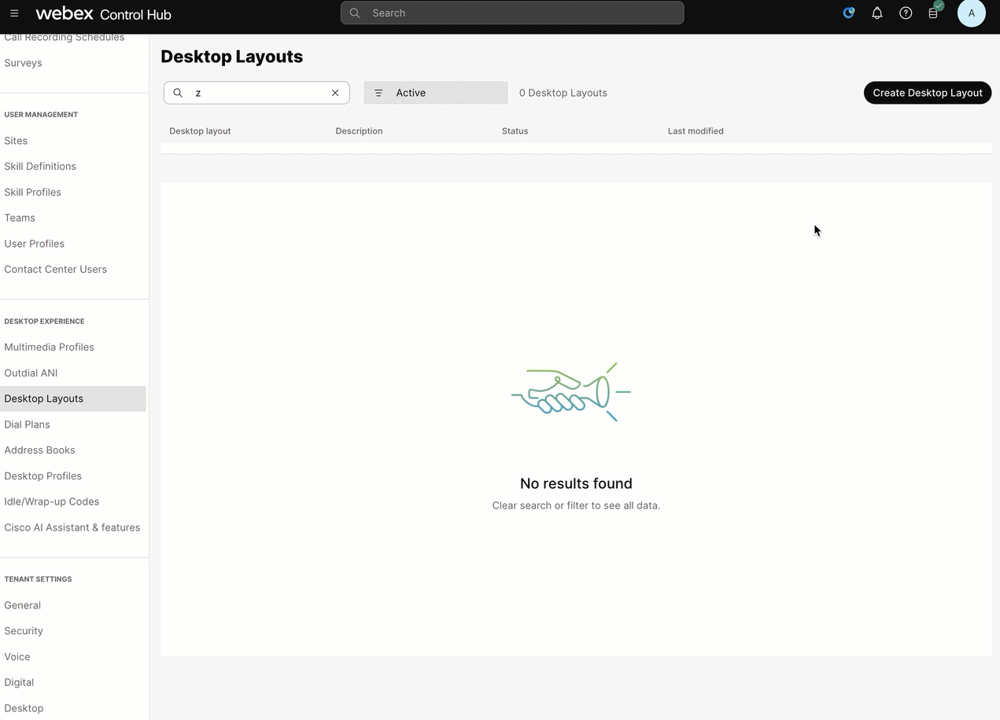

> **Note**: To log in to the agent desktop, use either a different web browser or a new incognito web page. This will prevent the browser caching issues with admin and agent credentials.
> Depending on your tenant's location the agent ULR link can be different. The example below is for the tenant in the US datacenter.
{: .block-tip }

1. Navigate to **[https://desktop.wxcc-us1.cisco.com/](https://desktop.wxcc-us1.cisco.com/){:target="\_blank"}** in the **chrome browser** with the incognito mode.

2. Enter the agent’s **email ID** which you created in the previous task.

3. Enter the **Password** for the appropriate username.

4. In the **_Station Credentials_** pane, select **"Desktop"**.

5. Select the team **<w class="attendee_out">Your_Attendee_ID</w>_Team1**.

6. Click **_Submit_** button. The browser may ask you to confirm use the microphone from the browser. 

7. Make sure that you are successfully logged in to the Agent Desktop.

8. Go to the 3rd icon in the navigation panel and type **gasathiy@cisco.com** in the **Lookup User** field 

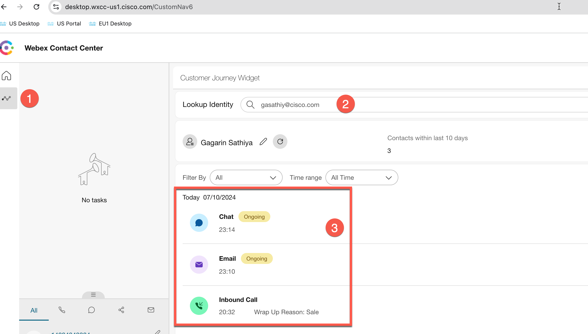


## 8.3 **[Bonus]** Exploring JDS APIs

!!! info "README"

    Please note that this section assumes a beginner-level understanding of APIs and familiarity with the Postman application. If you're not comfortable with these, don’t worry! The following steps will guide you through creating a custom application in Webex and using the APIs, allowing you to complete the lab by following the instructions. If you wish to learn more about the basics of Webex Contact Center APIs and how to use them, please refer to the linked content [here](https://webexcc-sa.github.io/partner-summit/pages/Advanced/#part-1-apis-on-webex-contact-center), which includes videos and step-by-step instructions.


**High Level Steps in this section:**
```
A. Create a webex application, capture the clientId and ClientSecret
B. Access JDS API postman collection
C. Create new events
```

### 8.3.A Create a webex application, capture the clientId and ClientSecret

This task shows you the configuration steps to create a Webex application. This covers how to build the authentication part of the application for use with Postman.

1.Logon to [https://developer.webex-cx.com](https://developer.webex-cx.com) with your Webex Contact Center username and password. On the top-right hand corner, hover over your userID and select My Webex Apps from the pop-out menu.


2.Provide the below details and create the application.
```
   a. Integration Name: "AttendeeID_WebexApp" (example: **140_WebexApp**)
   b. Description: Description_of_your_choice
   c. Redirect URI: https://oauth.pstmn.io/v1/callback
   d. Scopes: Check - cjp:config, cjp:config_write, cjp:config_read
```   
For the URI, we are using Postman as a sample application so, use this URI: **https://oauth.pstmn.io/v1/callback** and select the top 3 scopes as shown in the screenshot below

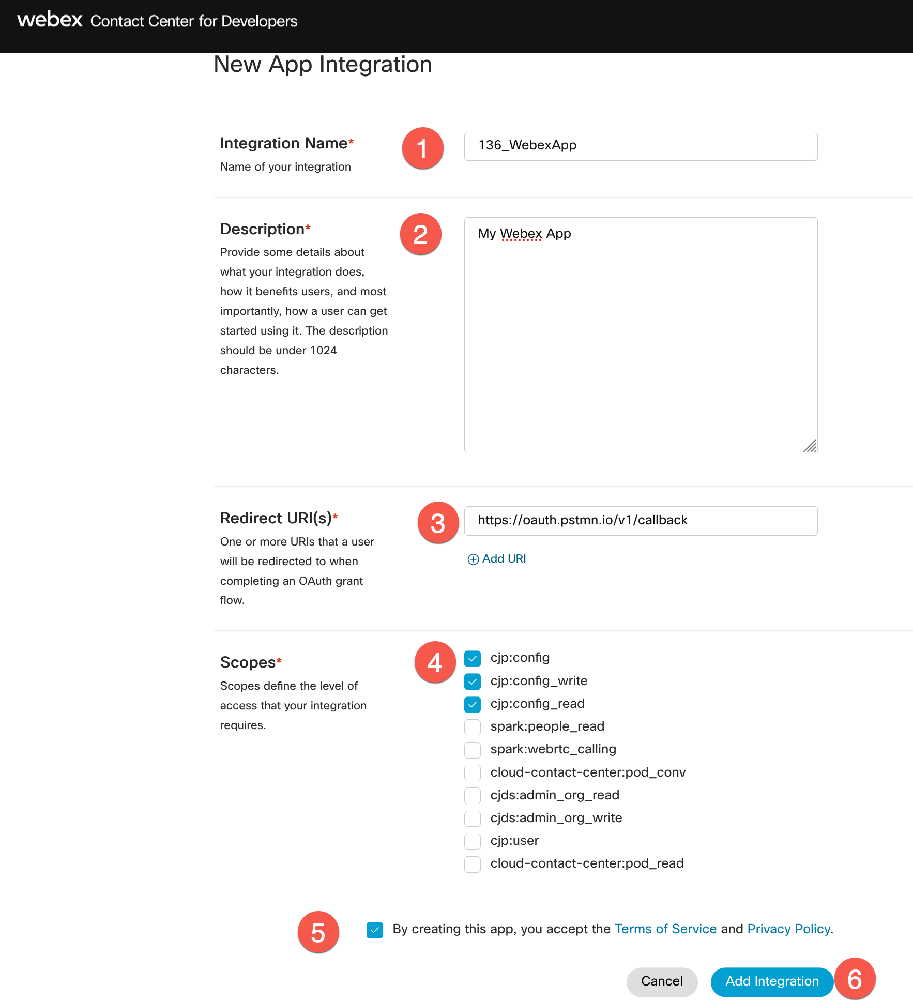

3.You will get the response with the Client ID, Client Secret, and the URL that you could embed in your application to initiate the authentication. 

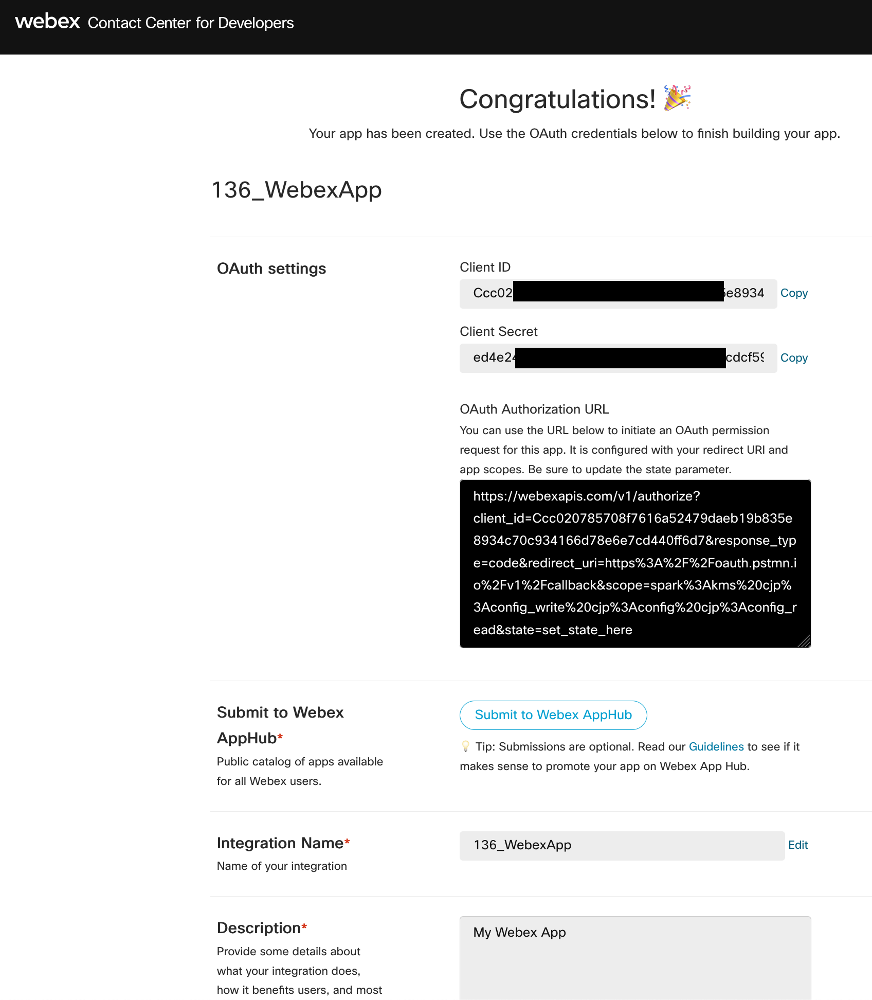


4.Save Client ID and Secret ID into a text file. We will use it later.

**Caution**: Caution: Do not share or publish your production Client ID and Secret ID, as they can be exploited by malicious individuals to compromise your system.

5.Copy the whole URL into a new browser window and you see that redirect you to a Webex authentication page.


6.On the authentication window, click Accept.


7.You see that your application is now authenticated.


More Information about creating a Webex application and using Postman in this document: [https://www.cisco.com/c/en/us/support/docs/contact-center/webex-contact-center/218418-configure-webex-contact-center-apis-with.html](https://www.cisco.com/c/en/us/support/docs/contact-center/webex-contact-center/218418-configure-webex-contact-center-apis-with.html)


### 8.3.B Access JDS API postman collection

As JDS is an API-first solution, there is a very wide [range of APIs](https://developer.webex-cx.com/documentation/journey){:target="\_blank"} available. To make the introduction to them easier, Cisco has created a [JDS API Collection](https://github.com/WebexSamples/webex-contact-center-api-samples/blob/main/customer-journey-samples/cjds-postman-example/JDS%20CiscoLive.postman_collection.json){:target="\_blank"} that you can download and import in your API tool (e.g. Postman) and start playing around, in conjunction with various use cases. 

1.Download the JDS Postman collection, by going to the [GitHub samples page](https://github.com/WebexSamples/webex-contact-center-api-samples/blob/main/customer-journey-samples/cjds-postman-example/JDS%20CiscoLive.postman_collection.json){:target="\_blank"}

2.Click on **Download raw file**


3.Open the Postman app on your laptop and click on **Import** button.
   
4.Select the downloaded JSON file in the appeared window


5.Once the JDS collection is imported, select the root folder of the imported collection in the left menu, then navigate to the **Variables**, and define the values 
> Note: reuse the same values as it was in the API lab (client ID, client Secret and org ID). The **workspaceId** is your project ID which is **65171e0682b7f52b9209b39d**

Fetching OrgID
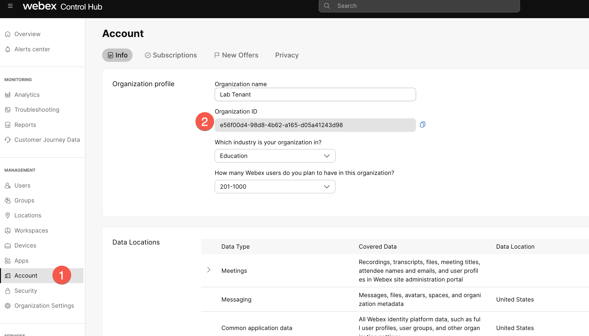

Fetching WorkspaceID
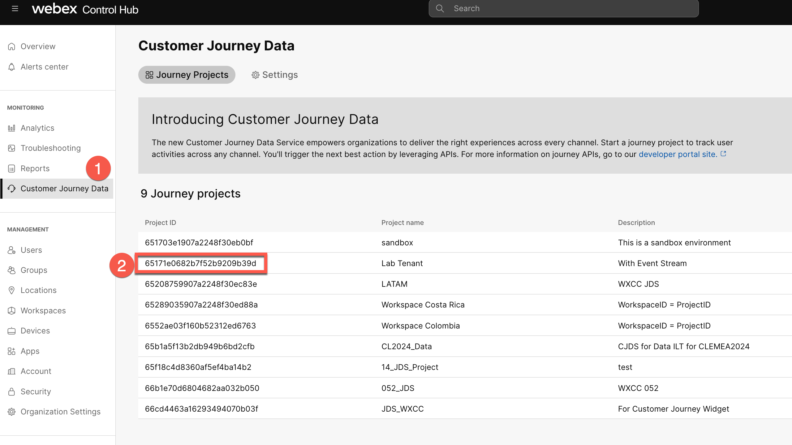

6.Once the values are defined, click **Save** button

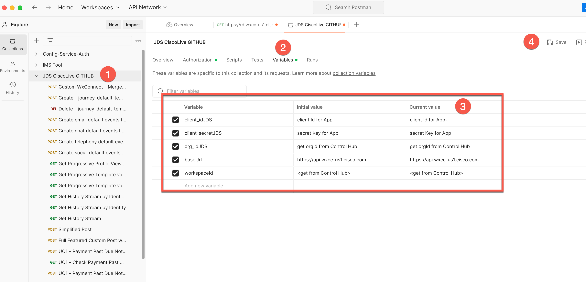

7.Go to **Authorization** and click on **Get New Access Token** button. The Postman will redirect you to the Auth page where you need to define your Admin account which was used for the App creation in the dev portal. As a result, you should get the message **Authentication complete**. Click **Proceed** and on the next page click on **Use Token** button


### 8.3.C Create new events


1.Let’s try to create a new event via API. Let's start with the default-generated events such as email and chat.
   
2.In the Postman, navigate to the **Create email default events for journey-default-template** 

3.Change **identity** and **"origin"** to **"gasathiy@cisco.com"**. Your API body should look like the below.
```
{
  "specversion": "1.0",
  "type": "task:new",
  "source": "wxcc",
  "id": "{{$guid}}",
  "identity": "gasathiy@cisco.com",
  "identitytype": "email",
  "datacontenttype": "application/json",
  "data": {
    "taskId": "{{$guid}}",
    "origin": "gasathiy@cisco.com",
    "channelType": "email"
  }
}
```

4.Click on **Send** button and verify the response status. It should be **202 Accepted**

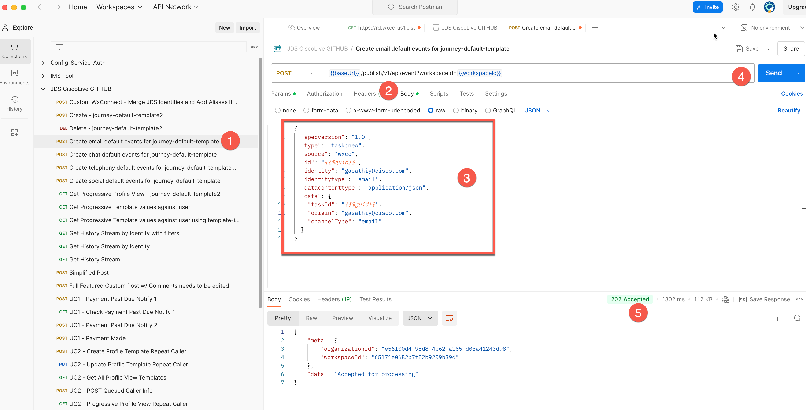

5.Now do the same step 3 with chat by clicking on **Create chat default events for journey-default-template**

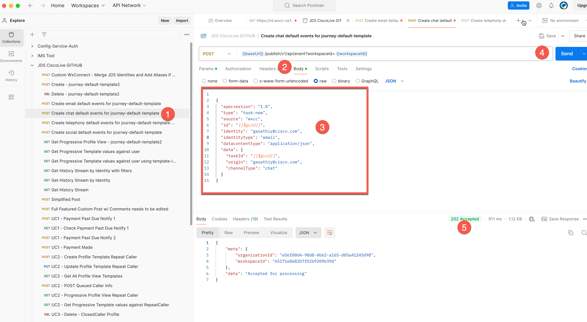

6.Go back to the JDS widget in the Agent Desktop and verify the result. You can refresh the page if the events have not appeared. Now you should see new events in the right panel


> Note: We can create any kind of Event and add it to the customer’s journey (e.g. customer visited our webpage).

Additional Content: This video shows you how to use various API's to manage JDS profiles and templates.

<div style="padding-bottom:60.25%; position:relative; display:block; width: 100%">
    <iframe src="https://app.vidcast.io/share/embed/9c7f0d45-d860-4962-99d2-d5d818fde573" width="100%" height="100%" title="JDS Postman Collection" frameborder="0" loading="lazy" allowfullscreen style="position:absolute; top:0; left: 0"></iframe>
</div>

<!-- 7.Now let's do a custom event by duplicating the existing API request and customizing the body. Click on `...` in front of **Create chat default events for journey-default-template**.


9. As the result the new HTTP record is created. Now change the body by copying the code below and replacing in the created request:
```
{  "id": "TEST",
  "specversion": "1.0",
  "type": "test",
  "source": "test",
  "identity": "+3227045654",
  "identitytype": "phone",
  "datacontenttype": "application/json",
  "data": {
    "phone": "+3227045654",
    "status": "New Booking",
    "origin": "WEB - FLY HIGH",
    "channelType": "Payment Complete",
    "topic": "Paradise destination",
    "channelBreakout": "Web Page Visit"
}}
```

9. Click on **Send** button and check the new event at the agent desktop.


> Note: The `data.channelType` defines a particular icon of every incoming journey event.
The entire mapping list can be found on GitHub: https://github.com/CiscoDevNet/cjaas-widgets/blob/jds-widget-9.0.0/CustomerJourney/README-VERSION-9.0.0.md


## 8.2: Use Case: Journey Based Queue Priority
A customer has contacted his travel service several times in the last couple of days. The next incoming call could be prioritized if a specific threshold is met (for example: the number of contacts on a particular reservation in the last 2 days greater than 2) 


**Task 1: Getting the total number of requests for the X days/hours**
1. The journey profile template aggregates the values and provides you with the total number of events for a specific time. Make sure that your journey profile template has the right view which includes lookBackPeriod for the last 48 hours. In the layout, we have already defined the template with the specific name
```
"template-id": "journey-default-template1",
```

2. For verifying the profile view go to the Postman API **Get Progressive Profile View - journey-default-template2** and change the URL parameter from
`journey-default-template2` to `journey-default-template1`. As the result you should get {{baseUrl}}/admin/v1/api/profile-view-template/workspace-id/{{workspaceId}}/template-id/journey-default-template1. 

3. Run this GET API and verify that it includes settings for the last 48 hours. 


4. If you are using a different tenant, you need to create the template with the name defined in the layout. In order to do it, go to **Create - journey-default-template2** API in Postman and replace the body with this code


```
{
    "name": "journey-default-template1",
    "attributes": [
        {
            "version": "0.1",
            "event": "task:new",
            "metaDataType": "string",
            "metaData": "origin",
            "limit": 100,
            "displayName": "No of times contacted in the last 24 hours",
            "lookBackDurationType": "hours",
            "lookBackPeriod": 24,
            "aggregationMode": "Count",
            "rules": null,
            "widgetAttributes": {
                "type": "table"
            },
            "verbose": true
        },
        {
            "version": "0.1",
            "event": "task:new",
            "metaDataType": "string",
            "metaData": "origin",
            "limit": 200,
            "displayName": "No of times contacted in the last 48 hours",
            "lookBackDurationType": "hours",
            "lookBackPeriod": 48,
            "aggregationMode": "Count",
            "rules": null,
            "widgetAttributes": {
                "type": "table"
            },
            "verbose": true
        },
        {
            "version": "0.1",
            "event": "task:new",
            "metaDataType": "string",
            "metaData": "origin",
            "limit": 700,
            "displayName": "No of times contacted in the last 7 days",
            "lookBackDurationType": "days",
            "lookBackPeriod": 7,
            "aggregationMode": "Count",
            "rules": null,
            "widgetAttributes": {
                "type": "table"
            },
            "verbose": true
        },
        {
            "version": "0.1",
            "event": "task:new",
            "metaDataType": "string",
            "metaData": "origin",
            "limit": 100,
            "displayName": "No of times contacted in the last 7 days via email",
            "lookBackDurationType": "days",
            "lookBackPeriod": 7,
            "aggregationMode": "Count",
            "rules": {
                "logic": "SINGLE",
                "condition": "task:new,channelType,string,Value EQ email"
            },
            "widgetAttributes": {
                "type": "table"
            },
            "verbose": true
        },
        {
            "version": "0.1",
            "event": "task:new",
            "metaDataType": "string",
            "metaData": "origin",
            "limit": 100,
            "displayName": "No of times contacted in the last 7 days via chat",
            "lookBackDurationType": "days",
            "lookBackPeriod": 7,
            "aggregationMode": "Count",
            "rules": {
                "logic": "SINGLE",
                "condition": "task:new,channelType,string,Value EQ chat"
            },
            "widgetAttributes": {
                "type": "table"
            },
            "verbose": true
        },
        {
            "version": "0.1",
            "event": "task:new",
            "metaDataType": "string",
            "metaData": "origin",
            "limit": 100,
            "displayName": "No of times contacted in the last 7 days via telephony",
            "lookBackDurationType": "days",
            "lookBackPeriod": 7,
            "aggregationMode": "Count",
            "rules": {
                "logic": "SINGLE",
                "condition": "task:new,channelType,string,Value EQ telephony"
            },
            "widgetAttributes": {
                "type": "table"
            },
            "verbose": true
        }
    ]
}
```

4. Now let's get the **person-id**, by running **Get Identity** API. Modify the URL in Postman and put the number **+3227045654** after the alias. You should get
`GET {{baseUrl}}/admin/v1/api/person/workspace-id/{{workspaceId}}/aliases/3227045654`


5. Save in notepad the person ID, which is "65ad476d01e91d3fe3f65e5c". You will need it for the next API
   
6. Go to **Get Progressive Template values against user** and modify the URL by defining the person-id and right template name. It should be:
`{{baseUrl}}/v1/api/progressive-profile-view/workspace-id/{{workspaceId}}/person-id/65ad476d01e91d3fe3f65e5c/template-name/journey-default-template1`

7. Run the API and check the response for the last 48 hours. The **result** is the total number of events for the last 2 days. We will use that value for the routing decision in the next task. 


**Task 2: Adding JDS API Request to the Flow Designer**

In order to achieve that use case, we will need to use 2 JDS APIs:
- Get the person-id API - https://developer.webex-cx.com/documentation/journey/v1/search-for-an-identity-via-aliases
- Get Progressive Template values against user - https://developer.webex-cx.com/documentation/journey/v1/historic-progressive-profile-view-using-template-name

1. By using your admin account, go to the Control Hub -> Webex CC -> Flows https://admin.webex.com/wxcc/routing-flows/flows

2. Open the flow which was created during the Fundamental lab

> Note: Alternatively, you can create a new Flow and map your Entry Point and DN to that Flow.

3. In Postman, go to the JDS root folder -> Authorization -> Token and copy the access token to the notepad
> Note: For this task, we will use the temporary access tokens which will expire after 8-12 hours. Soon we will be releasing the Webex CC API Connector, which will allow you to generate OAuth2 access tokens directly from the Flow Designer.


4. Go back to the Flow Designer, you will need to create the following logic


4a. Click on the main canvas and add 2 Flow Variables:
- **Identity** with type String
- **Total_Requests** with the type Integer

4b. Add the **HTTPRequest_1** activity with the following Settings:
- Request URL: https://api-jds.prod-useast1.ciscowxdap.com/v1/api/person/workspace-id/65171e0682b7f52b9209b39d/aliases/\{\{NewPhoneContact.ANI}}
- Method: GET
- HTTP Request Headers Key: Authorization
- HTTP Request Headers Values: Bearer + Your access token from Postman
- Content Type: Application/JSON
- Parse Settings Content Type: JSON
- Parse Settings Output Variable: Identity
- Parse Settings Path Expression: $.data[0].id

4c. Add the **HTTPRequest_2** activity with the following Settings:
- Request URL: https://api-jds.prod-useast1.ciscowxdap.com/v1/api/progressive-profile-view/workspace-id/65171e0682b7f52b9209b39d/person-id/\{\{Identity\}\}/template-name/journey-default-template1
- Method: GET
- HTTP Request Headers Key: Authorization
- HTTP Request Headers Values: Bearer + Your access token from Postman
- Content-Type: Application/JSON
- Parse Settings Content-Type: JSON
- Parse Settings Output Variable: Total_Requests
- Parse Settings Path Expression: $.data[0].attributes[1].result

4d. Add the **Condition** activity with the following Settings:
- Expression: **\{\{ Total_Requests > 2 \}\}**

4e: Add 2 queue activities **Queue Contact** with different priorities in the General Settings (as shown in the screenshot above)

4f: Publish the Flow by clicking on **Validation** toggle, **Publish Flow** button and selecting the **Live** tag.
 
**Task 3: Making a test call and checking the result**
1. Make your agent available for that queue
   
2. Make 3 test calls to the agent

3. Open **DEBUG** tool in the Flow Designer by clicking on **DEBUG** button and verify though which queue the 3rd call was delivered


<p style="text-align:center"><strong>Congratulations, you have completed this lab! You can continue with the next one.</strong></p>
        
<p style="text-align:center;"></p>	 -->


