

<!-- # Table of Contents

| Topic                                                                                                                                             | Type        | Dificulty    | Time   |
| ------------------------------------------------------------------------------------------------------------------------------------------------- | ----------- | ------------ | ------ |
| [Pre-Requisites](#pre-requisites)                                                                                                                 | Activity    | EASY         | 5 min  |
| [Analyzer and Desktop Login Process](#analyzer-login-process)                                                                                     | Activity    | EASY         | 5 min  |
| [Part 1: Webex Contact Center Analyzer User Interface](#part-1-webex-contact-center-analyzer-user-interface)                                      | Exploration | EASY         | 15 min |
| [1.1: Analyzer User Interface](#11-analyzer-user-interface)                                                                                       | Exploration | EASY         |        |
| [1.2: NEW Analyzer User Interface](#12-new-analyzer-user-interface)                                                                               | Activity    | EASY         |        |
| [Part 2: Contact Center Insights with New Analyzer Stock reports](#part-2-contact-center-insights-with-new-analyzer-stock-reports)                | Activity    | EASY         | 15 min |
| [2.1: High-level Contact Center Performance and Usage insights](#21-high-level-contact-center-performance-and-usage-insights)                     | Activity    | EASY         |        |
| [2.2: Customer Experience and Queue Performance](#22-customer-experience-and-queue-performance)                                                   | Activity    | INTERMEDIATE |        |
| [Part 3: Contact Center Insights with Analyzer custom reports](#part-3-bonus-contact-center-insights-with-analyzer-custom-reports-and-dashboards) | Activity    | INTERMEDIATE | 15 min |
| [3.1: Create Custom Realtime Agent Report](#31-create-custom-realtime-agent-report)                                                               | Activity    | INTERMEDIATE |        |
| [Part 4: (BONUS) Data extraction and scheduling Capabilities](#part-4-bonus-data-extraction-and-scheduling-capabilities)                          | Activity    | EASY         | 20 min |
| [4.1: Export Data as Excel or CSV](#41-export-data-as-excel-or-csv)                                                                               | Activity    | EASY         |        |
| [4.2: Visualization Scheduler](#42-visualization-scheduler)                                                                                       | Activity    | EASY         |        |
| [4.3: Search APIs](#43-search-apis)                                                                                                               | Activity    | INTERMEDIATE |        | -->

## Pre-Requisites

**Create Chrome Profiles**

- For the lab, create new Chrome profiles so that you can login the Administrators, Agents and Supervisors using the same Browser.

  - Select `Profiles` on Chrome
  - Select `Add Profile`
  - Select `continue without an account`
  - Give it a name .i.e `Admin`
  - Click `done`
  - Create 2 more profiles for `Supervisor` and `Agent`

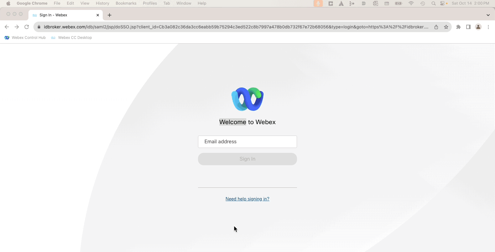

- Ensure that you have received your tenant login credentials (Administrator, Supervisor and Agent) from the Lab proctors.
- Login to  [Webex Control Hub](https://admin.webex.com)
- Navigate to `Contact Center`

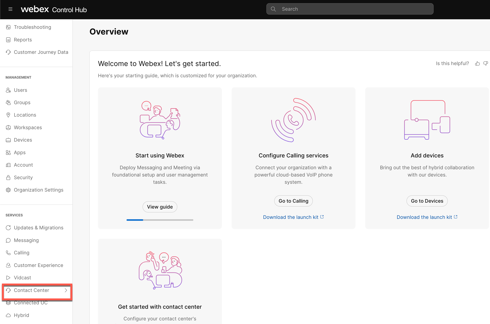

- Navigate to `Overview` and under quick links, select `Analyzer` 

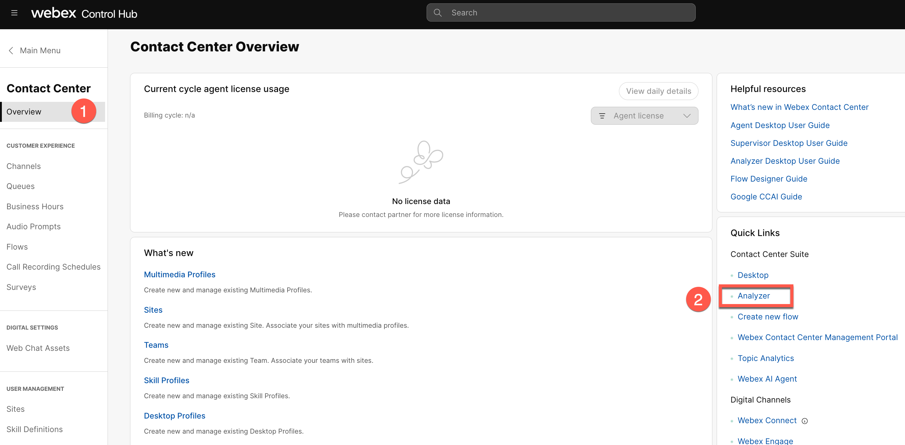

- Make sure the login is successful

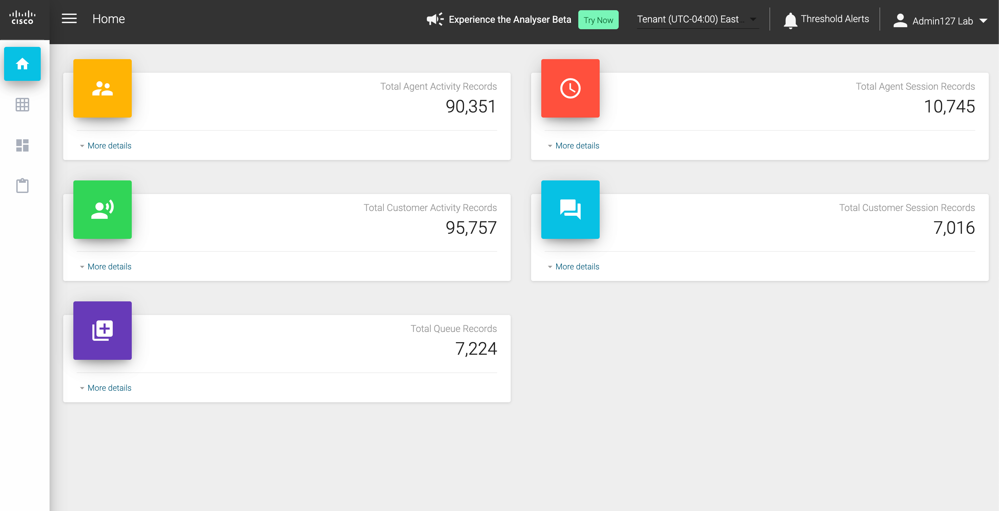

!!! tip "In this lab, most sections already have historical data available to capture key insights, so there is no need for agents to log in or for calls to be made. However, if you wish to explore real-time reporting, agent login can be used as an optional step."

<!-- 
***You Will Need***

1. **One additional device** (like your personal phone) to test inbound calls to the Webex Contact Center. You can use your cell phone for this purpose.

   - Administrator credentials for the Control Hub: admin.webex.com.
   - Agent Login Credentials for the Agent Desktop: desktop.wxcc-us1.cisco.com.

2. The items listed below have been pre-configured for you:
   - Agent and Supervisor user accounts are configured and ready for login.
   - You can access the Agent Desktop via the URL: [https://desktop.wxcc-us1.cisco.com](https://desktop.wxcc-us1.cisco.com).
   - As an agent, you're associated with two teams —designated by your Attendee ID— as "Team1" and "Team2".

Example:

> If your attendee ID is 100:
>
> 100_Team1
>
> 100_Team2

1. Agents will use browsers for voice calls using WebRTC (Web Real-time Communication) endpoints. Additionally, Webex Calling extensions have been assigned to users (supervisors) to facilitate alternate device experiences.

2. A preset inbound Voice flow is available for test calls. -->

## Lab Configuration

!!! tip "Please submit the form below with your Attendee ID in 3 digits long format (e.g. if your attendee ID is 51, please enter 051) and click Save. All configuration items in the lab guide will be renamed with that prefix."

    
    <form id="attendee-form">
    <label for="attendee">Attendee ID:</label>
    <input type="text" id="attendee" name="attendee" onChange="update()" style="border: 2px solid black; padding: 5px; border-radius: 4px; background-color: orange;"> 
     
    <button type="button" onclick="update()" style="background-color: #4CAF50; color: white; padding: 10px 20px; border: none; border-radius: 5px; cursor: pointer; font-size: 16px;">Save</button>
    </form>
    

The following Administration entities have been configured for you via [Webex Control Hub](https://admin.webex.com){:target="\_blank"}.

Please note, that to proceed to the next section, you will need to use the accounts shown below.

| **Entity**    | **Name**                                                            |
| ------------- | ------------------------------------------------------------------- |
| Agent 1       | wxcclabs+agent_ID<w class = "attendee_out">AttendeeID</w>@gmail.com |
| Supervisor 1  | wxcclabs+supvr_ID<w class = "attendee_out">AttendeeID</w>@gmail.com |
| Administrator | wxcclabs+admin_ID<w class = "attendee_out">AttendeeID</w>@gmail.com |

<!-- 
# Analyzer Login Process

1.  Make sure you are able to login into Administrator Portal ([admin.webex.com](https://admin.webex.com) using your Administrator credentials.
2.  Once logged-in, go to `Quick Links` on the right and click on `Analyzer`.
  
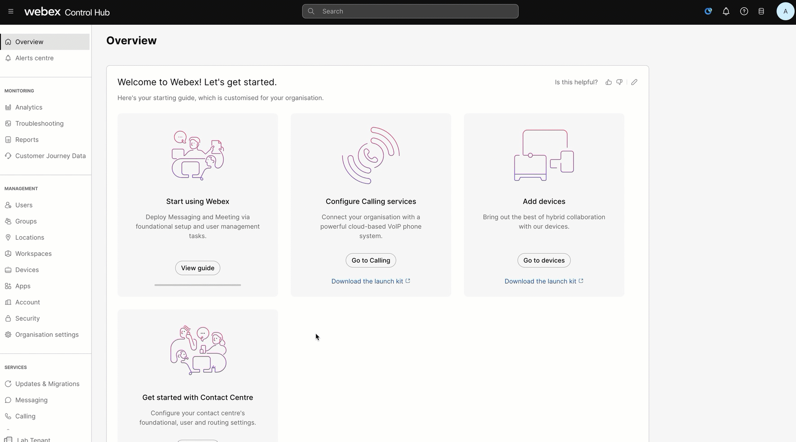
 -->

<!-- 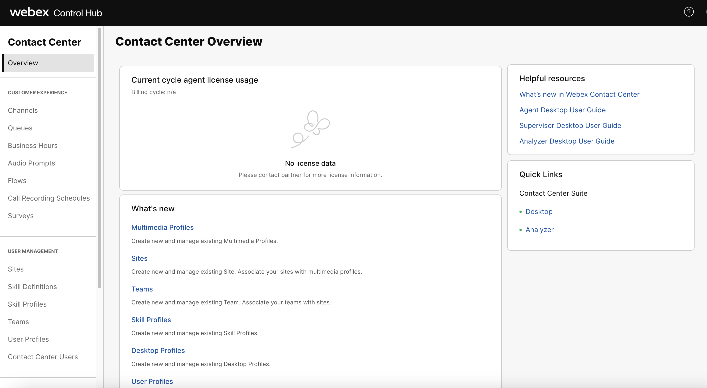
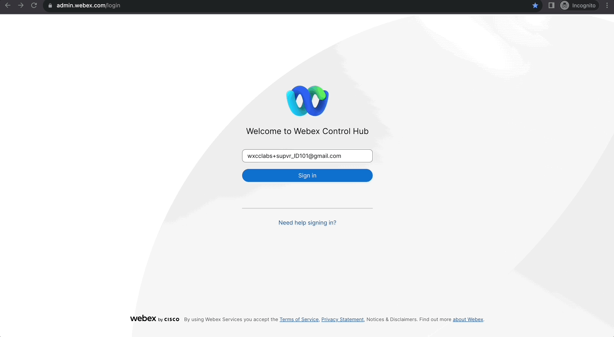 -->
 <!-- 3.  For Part 3 of the Lab, login as an Supervisor-agent or Agent :

> Note: If you are already logged-in as an Agent as part of other Labs, no action is required.
> {: .block-tip }

You have 2 options to login as an Agent:

1.  Supervisor credentials with Role as `Supervisor and Agent`
2.  Using your Agent Credentials

***Login As Supervisor-Agent***

> Note: Currently supervisors can not login via Desktop/WebRTC. If you want to test a login with WebRTC, make sure to sign in as an agent, as per the steps on the next chapter.

| **User Role** | **User email**                                                   | **Endpoint**        |
| ------------- | ---------------------------------------------------------------- | ------------------- |
| Supervisor    | wxcclabs+supvr\_<w class="attendee_out">AttendeeID</w>@gmail.com | Webex App/Extension |

- Login with Supervisor Credentials [admin.webex.com](https://admin.webex.com).
- Go to `Quick Links` Click on `Desktop`.
- Select the Role as : `Supervisor and Agent`.
- Enter the Dialed number provided (if it is not pre-filled).
- Team should be pre-populated.
- Click `Submit`.

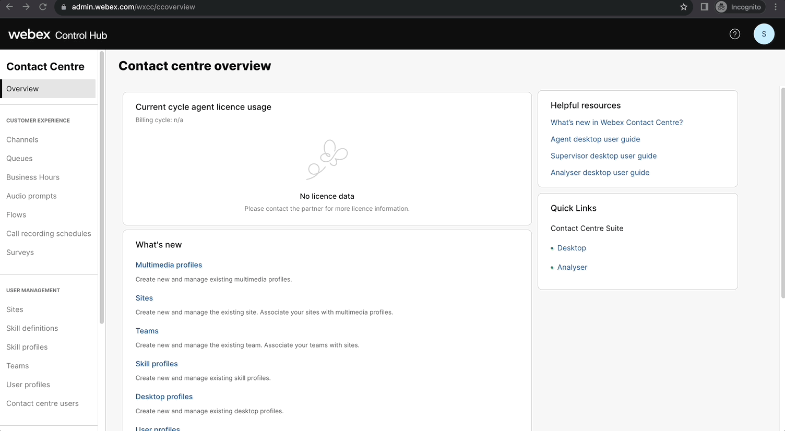

***Login in the Webex app for PC or Mac***

> In this lab, we can use the Webex app for PC or Mac to login to the Desktop with the **supervisor** account.
> {: .block-warning }

- Download Link: **[https://www.webex.com/downloads.html](https://www.webex.com/downloads.html){:target="\_blank"}**

- Install the application on your PC/Mac.

- Open Webex app and сlick **Sign In**. Enter the provided supervisor credentials.

***Agent Desktop Login***

| **User Role** | **User email**                                                   | **Endpoint**   |
| ------------- | ---------------------------------------------------------------- | -------------- |
| Agent         | wxcclabs+agent\_<w class="attendee_out">AttendeeID</w>@gmail.com | WebRTC/Desktop |

> **Note**: To log in to the agent desktop, use either a different web browser or a new incognito web page. This will prevent the browser caching issues with admin and agent credentials.
>
> {: .block-tip }

- Navigate to **[Desktop](https://desktop.wxcc-us1.cisco.com/){:target="\_blank"}** in the chrome browser with the incognito mode.

- Enter the agent’s **email ID**.

- Enter the **Password** for the appropriate username.

- In the **_Station Credentials_** pane, select **"Desktop"**.

- Select the team **<w class="attendee_out">Your_Attendee_ID</w>\_Team1**.

- Click the **_Submit_** button. The browser may ask you to confirm the use the microphone from the browser.

- Make sure that you are successfully logged in to the Agent Desktop.

 -->

# Agent Login Process

- Go to [https://desktop.wxcc-us1.cisco.com/](https://desktop.wxcc-us1.cisco.com/)

- Enter your respective agent login credentials to login here 

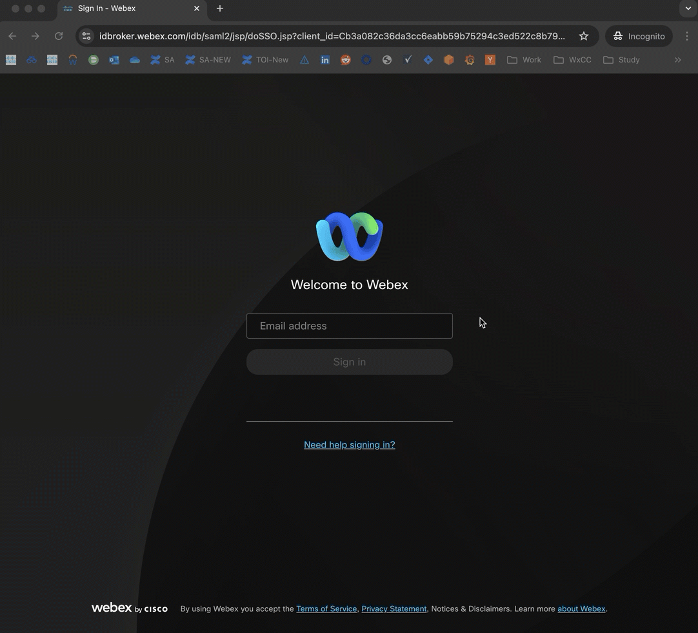

- Select `Desktop` as the telephony option and your respective Team1 (_Agents will use browsers for voice calls using WebRTC (Web Real-time Communication)_)

Example:
> If your attendee ID is 100:
>
> 100_Team1

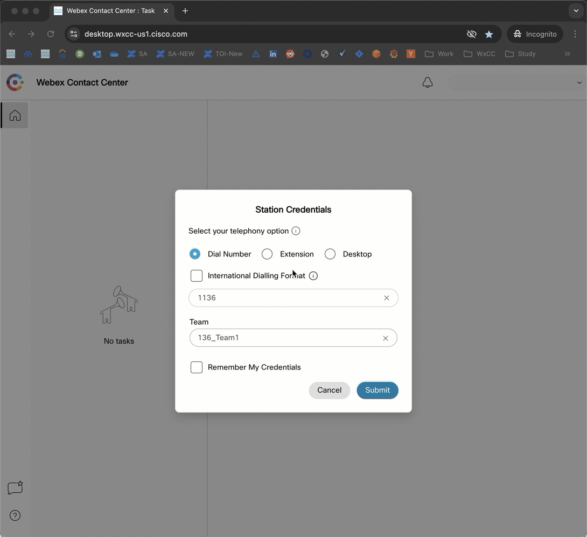

# Identify EP-DN

- Go back to [Webex Control Hub](https://admin.webex.com) and navigate to `Contact Center`

- Navigate to `Channels` and search for your respective entrypoint based on the attendee ID. **_For example, if your attendee ID is 101, then the entrypoint name will be WX1_EP_101_**

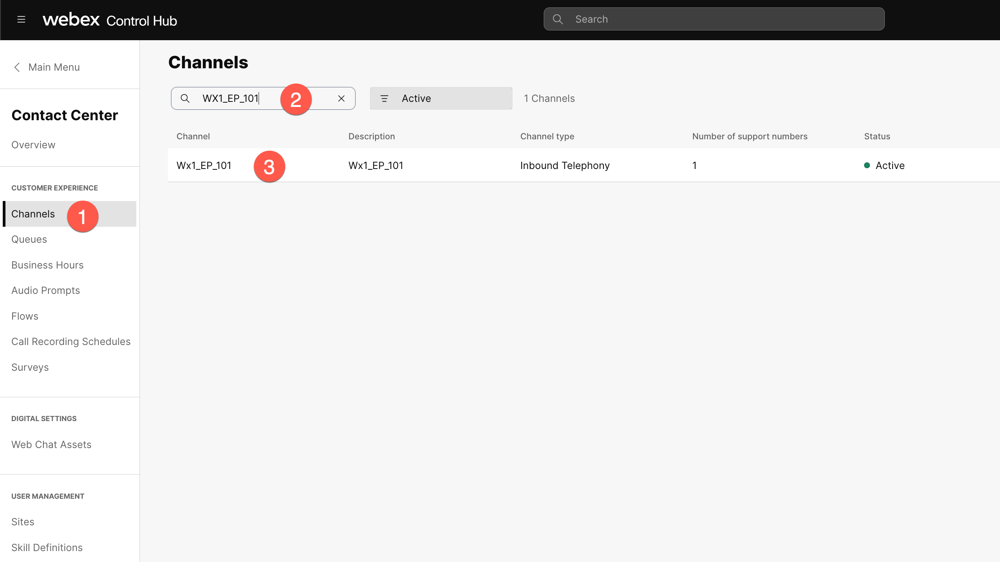

- Verify that routing flow is set to `WX1_Data_Survey`
- Verify that version label is set to `Latest`
- Identify and make a note of the Support Number

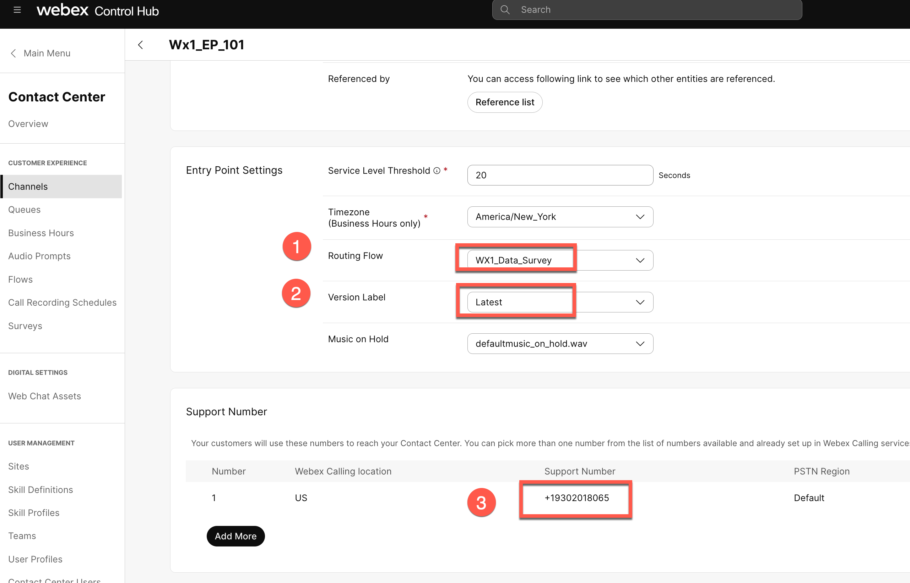

- Navigate to `Queues` search for your respective queue based on the attendee ID. **_For example, if your attendee ID is 101, then the queue name will be WX1_Q_101_**

-  Verify that the correct team based on your attendee ID is selected in the configuration. **_For example, if your attendee ID is 101, then the team should be 101_Team1_** 

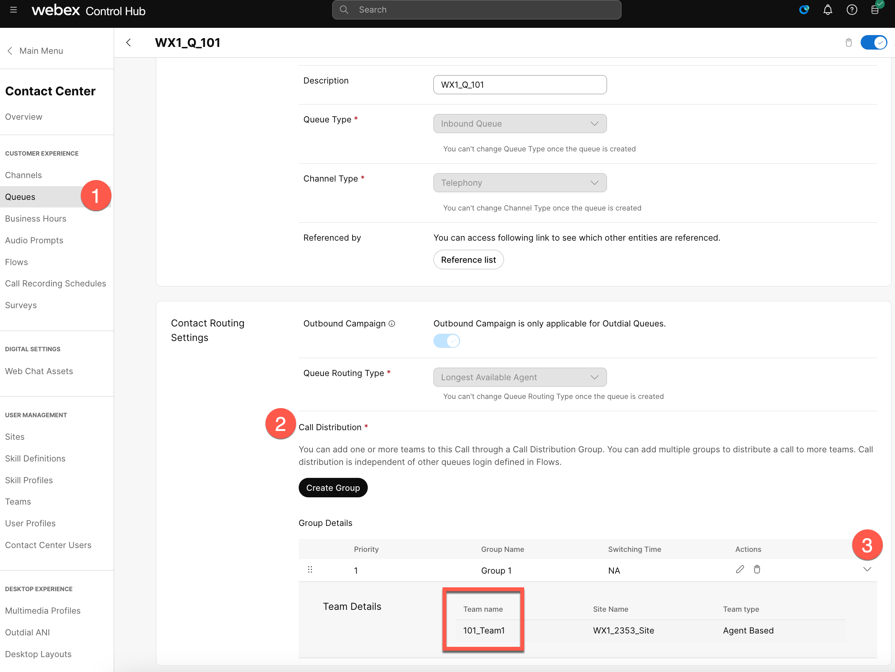

# Test Agent call routing: 

- From your mobile phone, make a Call to the respective Entrypoint DN identified in the previous step. You will be prompted to enter your 3-digit attendee ID (for Eg. If your attendee ID is 77, then enter 077). After which call will be routed to your agent.

- If call is not routing to your agent login, please report to the lab instructor and continue with the rest of the lab.

<!-- !!! tip "Please submit the form below with your Attendee ID in 3 digits long format (e.g. if your attendee ID is 51, please enter 051) and click Save. All configuration items in the lab guide will be renamed with that prefix."

   You can skip the "Supervisor Login" section if you are using a mobile phone and continue testing with it. However, if you don't have access to a mobile phone or would prefer to try an alternative method for testing calls, please follow the steps outlined in the next section.
 -->

# [OPTIONAL] Supervisor Login

> Note: Currently supervisors can not login via Desktop/WebRTC. If you want to test a login with WebRTC, make sure to sign in as an agent, as per the steps mentioned in the previous chapter.

| **User Role** | **User email**                                                   | **Endpoint**        |
| ------------- | ---------------------------------------------------------------- | ------------------- |
| Supervisor    | wxcclabs+supvr\_<w class="attendee_out">AttendeeID</w>@gmail.com | Webex App/Extension |

- Login with Supervisor Credentials [admin.webex.com](https://admin.webex.com).
- Go to `Quick Links` Click on `Desktop`.

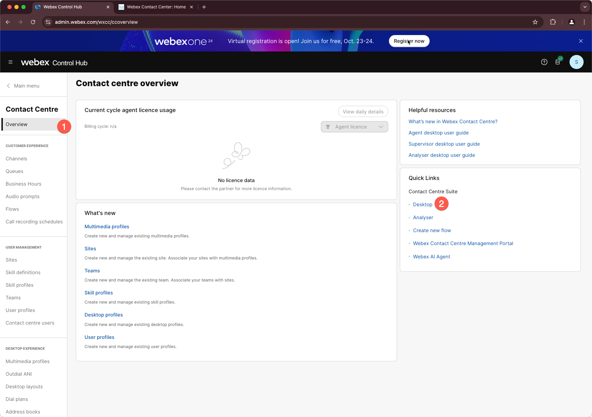

- Select the Role as : `Supervisor and Agent`.
- Select Dial number as `Extension`
- Enter the Dialed number provided (if it is not pre-filled).
- Team should be pre-populated.
- Click `Submit`.

<!--  -->

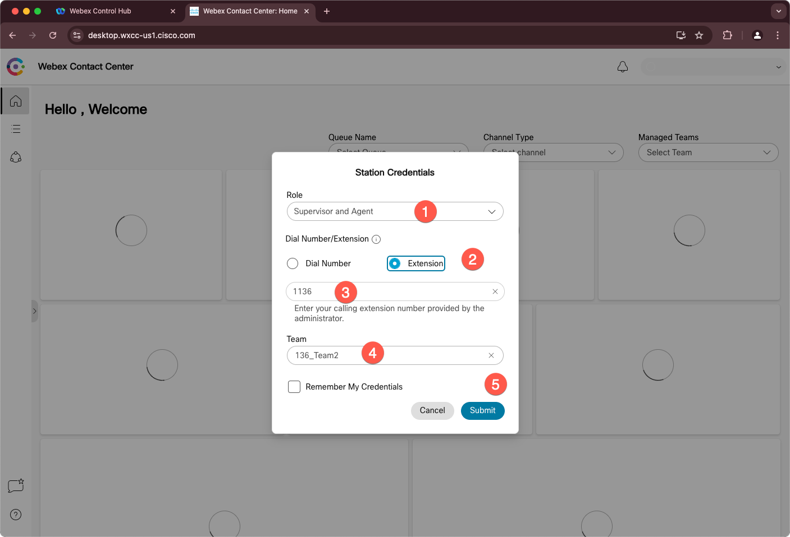

- In this lab, we will use the Webex app for PC or Mac and login to the Desktop with the **supervisor** account.

!!! warning "README"

    Check in PC if webex application has already been installed. If already installed, you do not have to reinstall the application. Just logout from any existing logins (if applicable) and then re login with the supervisor credentials.

- Download Link: **[https://www.webex.com/downloads.html](https://www.webex.com/downloads.html){:target="\_blank"}**

- Install the application on your PC/Mac.
- Open Webex app and сlick **Sign In**. Enter the provided supervisor credentials
- From the webex application, you can place calls to your respective entrypoint DN number
- The Supervisor will be logged into Team 2. There is no need to test any inbound calls with the Supervisor also logged in as an agent. The Supervisor's role is to explore the reporting capabilities available on the Supervisor desktop.